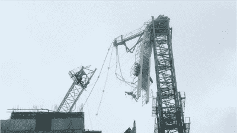

# 建筑起重机对抗飓风

> 原文：<https://hackaday.com/2018/10/15/construction-cranes-versus-hurricanes/>

当工程师在设计建筑物、桥梁或其他大型建筑项目时，会对环境进行大量考虑。其中一些考虑似乎是显而易见的，比如在旧金山设计一座能承受地震的摩天大楼，在纽约市建造一座不仅能承受自身重量，还能承受屋顶几英尺厚积雪重量的体育馆，或者在任何沿海地区建造一座能承受盐雾的桥梁。然而，并不是所有事情都这么简单。不仅结构本身必须耐受它们所处的环境条件，而且用于建造它们的设备也必须耐受这些条件，特别是通常半永久性地连接到它们的建筑工地的大型起重机。

最近记忆中最极端的例子可能是台风“曼狗”袭击香港期间。有几台大型建筑起重机在大风中表现不佳。[至少有一个人因此倒下](https://www.reddit.com/r/HongKong/comments/9g7wgq/construction_crane_topples_off_a_building_during/)，在视频中看到另一个人自由旋转[足以让你喘息](https://www.reddit.com/r/HongKong/comments/9g8dei/common_babie/)。台风中出现的其他建筑起重机视频显示了一些令人担忧但设计惊人的同类型起重机紧急操作。

## 建造高楼的起重机

在深入研究极端天气的注意事项之前，有必要讨论一下建筑工地上可能出现的不同类型的起重机。用于建造摩天大楼的大型起重机(以及在链接视频中看到的处于各种困境的起重机)被称为塔式起重机。它们被固定在一个混凝土基座上，这个基座是在建造过程中专门用来支撑起重机的。一旦基座完成，起重机的零件由轻型起重机吊起，一次组装一部分。部分桅杆也可以固定在建筑物的下部，以增加强度。这些起重机通常有一个固定的起重臂(顶部的水平部分，支撑配重和有效载荷)和一个滚动的小车。现场的其他起重机可能具有可以上下移动的变幅杆，并且一些起重机是可移动的，并且可以被拆卸到卡车上，以便从一个地点移动到另一个地点。

 [https://www.youtube.com/embed/UC9m3sGRlnE?version=3&rel=1&showsearch=0&showinfo=1&iv_load_policy=1&fs=1&hl=en-US&autohide=2&wmode=transparent](https://www.youtube.com/embed/UC9m3sGRlnE?version=3&rel=1&showsearch=0&showinfo=1&iv_load_policy=1&fs=1&hl=en-US&autohide=2&wmode=transparent)

在有许多塔式起重机同时运行的地方，它们都建在不同的高度，以防止起重臂相互碰撞。理想情况下，它们也应该远离其他结构，但在像香港这样人口和建筑密度如此之高的地方，为这些起重机建立合理的安全裕度通常是不切实际或不可能的，尤其是在暴风雨期间。

## 经受住风暴

不同的高度也有助于在大风期间，如台风或飓风。这些结构的设计是为了应对与它们所在的建筑相同的环境危害，所以如果暴风雨即将来临，起重机可以安全地停留在高空。然而在这种情况下，回转环被解锁，这允许起重臂像风向标一样自由旋转。这使得它自然地使其最低的横截面面积面向风，并尽可能地承受最小的压力，并且当风暴经过时，它允许它改变方向并处于最佳位置。由于这些塔都在不同的高度，即使在暴风雨中它们也不会互相碰撞。你没看错，上面链接的自由旋转起重机正在按设计运行！

从理论上讲，建造一座能够独自抵御飓风的塔形建筑是可能的。任何建在易受飓风袭击地区的塔式起重机都足够坚固，能够抵御强风。大多数热带风暴都是可以预测的，通常会在登陆前提前一周通知施工人员。因此，由于一些塔式起重机可以在几天内拆卸，因此可以及时将起重机拆卸下来并脱离危险。当然，像这样拆卸一台起重机，然后再把它装回去是很昂贵的，特别是在风暴改变路径，根本没有袭击建筑工地的情况下，但这可能比处理失控的塔倒塌要便宜。

 [https://www.youtube.com/embed/LUQalhFFnOE?version=3&rel=1&showsearch=0&showinfo=1&iv_load_policy=1&fs=1&hl=en-US&autohide=2&wmode=transparent](https://www.youtube.com/embed/LUQalhFFnOE?version=3&rel=1&showsearch=0&showinfo=1&iv_load_policy=1&fs=1&hl=en-US&autohide=2&wmode=transparent)

话虽如此，有时事情不会按计划进行。如果起重机基础中的混凝土不是完全正确的混合物，或者钢筋没有正确安装，或者锚固点没有尽可能安全，那么可能会出现问题。虽然在理想的晴空条件下，像这样的小问题可能不会被注意到(如果存在的话)，但在飓风这样的压力下，工程或建设中的任何小缺陷都会出现。即使是极端的阵风也能摧毁一台适当建造的起重机，而且飓风有一个讨厌的习惯，当它们登陆时会产生龙卷风。

## 超出规格

Miami crane collapse during Hurricane Irma via [Wochit News](https://www.youtube.com/watch?v=2bsB_jtPfrk)

不要陷入假设宽松的建筑法规或建筑标准是罪魁祸首的陷阱。拥有健全的建筑法规、许可和严格的工程标准的发达国家也不能幸免于恶劣天气导致的起重机突然故障。去年在飓风厄玛期间，两座塔式起重机在强风中倒塌。一名起重机操作员表示，故障是由于飓风中产生的龙卷风，这可能很容易超过飓风本身产生的最大持续风力等级。但同样重要的是要注意，伊尔玛的中心没有穿过迈阿密，如果它穿过了，我们很可能会看到更多的塔式起重机倒塌。

此外，据报道，这些起重机将需要两周时间才能拆除，这可能是一个设计缺陷(或糟糕的选择)，因为在这个地区，建筑法规规定结构必须能够承受 150 英里/小时的风，建筑工地的操作员可能只能在一周内得到一场大飓风即将到来的通知。从这些灾难中吸取教训，可以更容易地选择更容易拆卸、建造得更坚固以应对未来飓风的起重机，甚至可以限制在飓风季节之外的作业。尽管完全避开飓风季节对于大型建筑项目来说是不可行的。

## 当一切顺利的时候

这些原则中的一些在上个月的佛罗伦萨飓风中也发挥了作用。许多塔式起重机部署在夏洛特，尽管与迈阿密相比，夏洛特远在内陆，但仍然使用额定承受 100 英里/小时风速的起重机，[根据夏洛特观察家](https://www.charlotteobserver.com/news/local/article218145680.html)的一篇文章。当城市为可能的热带风暴做准备时，起重机被设置为自由旋转，所有的标志和横幅都被移除以减少风的阻力。尽管风暴对夏洛特的影响不如厄玛对迈阿密的影响大，但没有任何鹤类损失。

使用适当的设计标准和了解自己的环境对于建造大型结构是至关重要的，不仅仅是为了结构本身，也是为了用于建造它们的设备。可以设计和实施常识性的建筑实践来限制起重机故障的数量，但是一些外部影响(如龙卷风)很难设计，我们不太可能看到上一次起重机故障是由自然灾害造成的。我们能做的最好的事情就是按照高标准建造，并考虑到我们所处的环境。为了以防万一，也许可以买一份好的起重机保险。