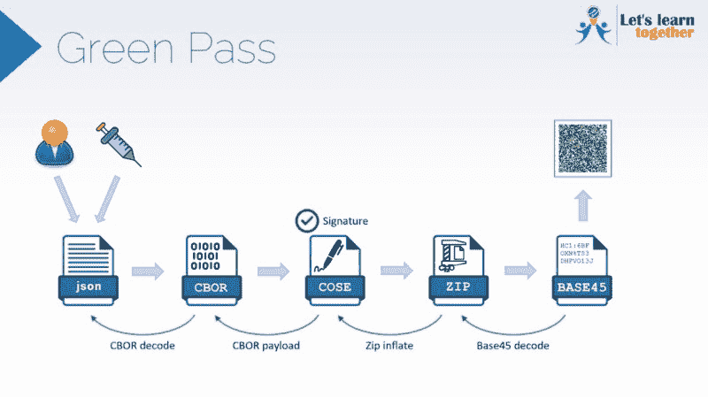

# 带有树莓 Pi 的 COVID 绿色通行证验证器

> 原文：<https://hackaday.com/2021/09/25/covid-green-pass-validator-with-raspberry-pi/>

似乎每个国家应对瘟疫的方式都有所不同。今年 6 月，欧盟推出了纸质或数字二维码形式的 COVID 绿色通行证。它的目的是润滑整个欧洲的旅行，并允许进入疗养院。从八月初开始，意大利 12 岁及以上的人需要绿色通行证才能进入酒吧、餐馆、博物馆、剧院等。—人们聚集成相当大的群体的任何地方。绿色通行证显示，你要么已经接种疫苗，患有 COVID 并康复，要么测试结果为阴性，每种情况都有不同的半衰期:接种疫苗 9 个月，康复 6 个月，阴性测试只有 48 小时。

[Luca Dentella]用树莓 Pi 和 Raspi 相机制作了一个绿色通行证验证器。实际验证必须通过官方应用程序来完成，所以这个项目只是出于教育目的。它是这样工作的:用户数据，包括他们的状态和通行证发放的日期/时间，被编码到一个 JSON 文件，然后到 CBOR，然后被数字签名以保证真实性。之后，这些信息被压缩成一个基数为 45 的字符串，在你的手机上被表示成一个二维码。幸运的是，[Luca]找到了卫生部长的 GitHub，它做了重新膨胀 JSON 对象的艰苦工作。

[Luca]的 Pi 摄像头读取 QR 并使用两个应用程序完成验证，这两个应用程序是用 Python 编写的摄像头客户端，用于查找 QR 并将其发送到 Node.js 编写的验证服务器。验证服务器进行正式验证，包括验证签名和业务规则(例如，自 Karen 测试为阴性是否已超过 48 小时？)任何一项失败，红色 LED 就会亮起；全部通过，你就能获得通过。演示视频在休息之后。

你是加拿大人吗？那就看看这个，嗯？

 [https://www.youtube.com/embed/CRlhOMs_VCc?version=3&rel=1&showsearch=0&showinfo=1&iv_load_policy=1&fs=1&hl=en-US&autohide=2&wmode=transparent](https://www.youtube.com/embed/CRlhOMs_VCc?version=3&rel=1&showsearch=0&showinfo=1&iv_load_policy=1&fs=1&hl=en-US&autohide=2&wmode=transparent)

