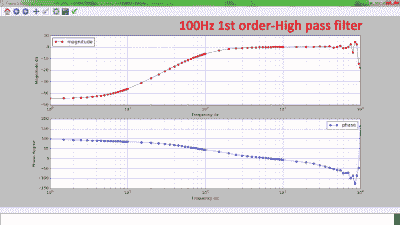

# 从微控制器创建波特分析仪

> 原文：<https://hackaday.com/2019/10/23/creating-a-bode-analyzer-from-a-microcontroller/>

电气工程师会将波特图视为系统频率响应图。它在 x 轴上显示频率，在 y 轴上显示相位(单位为度)或幅度(单位为 dB)，有助于在频域分析中理解电路或传递函数。

[Debraj]能够使用 STM32F407 发现板为电子电路构建一个 [Bode 分析仪](https://sites.google.com/site/hobbydebraj/bode-analyzer-using-stm32f407)。分析器的输入是一系列频率线性增加的正弦波信号或线性调频信号，最好是 20 个频率/十进制，以保持合理的频率范围。

来自 DAC 的信号施加于目标滤波器，输出(获得的频率)通过 ADC 回读。对结果的一些计算揭示了信号衰减的程度及其相位，从而得出波特图。滤波是通过微控制器的数字信号处理来完成的。

虽然信号最初通过一个物理 RC 滤波器，但用不同电路测试 Bode 绘图仪使信号通过数字滤波器变得更加容易，因为它不需要在原型板上焊接电阻和电容。使用 Python 的`matplotlib`进行绘图，通过分析确定输出的幅度和相位。

这是一个很酷的项目，它突出了微控制器作为更昂贵的矢量网络分析仪的替代品的一些功能。

 [https://www.youtube.com/embed/34CDkcJcqis?version=3&rel=1&showsearch=0&showinfo=1&iv_load_policy=1&fs=1&hl=en-US&autohide=2&wmode=transparent](https://www.youtube.com/embed/34CDkcJcqis?version=3&rel=1&showsearch=0&showinfo=1&iv_load_policy=1&fs=1&hl=en-US&autohide=2&wmode=transparent)

