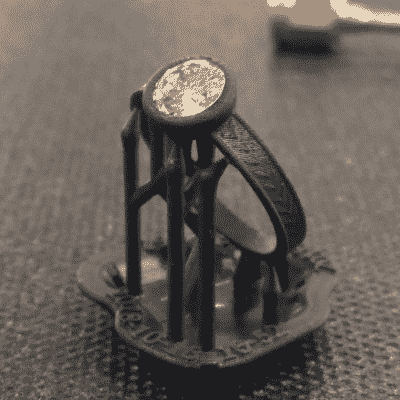

# 用 3D 打印制作定制订婚戒指

> 原文：<https://hackaday.com/2020/01/05/creating-a-custom-engagement-ring-with-3d-printing/>

即使你很确定答案会是什么，求婚也伴随着巨大的压力，以使这个事件尽可能地难忘和浪漫。你有很多细节要处理，尤其是戒指。所以为什么不减轻一些压力，直接 3D 打印出来呢？

 不，一枚俗气的 PLA 戒指可能不会让最了解的未婚妻满意，这根本不是【林志颖】用[这枚 DIY 订婚戒指](https://www.justinmklam.com/posts/2019/diy-wedding-ring/)所做的。他采取了工程师的方法来解决问题——收集规格，在 Fusion 360 中进行迭代设计更改，并让朋友打印了一个原型环 SLA。这使得他可以在将设计发送给 Shapeways 进行生产之前对其进行调整。我们惊讶地得知，珠宝印刷是一件大事，Shapeways 采用了失蜡工艺。首先，高分辨率蜡 SLA 打印机用于制作详细的阳图，然后用于制作石膏模具。模具被点燃以熔化蜡，熔化的黄金被倒入以制造粗铸件，在运输前被清洗和抛光。

一旦他有了戒指，[贾斯汀]看了一些珠宝制作视频，以学习如何将家族传家宝石镶嵌到挡板上；我们承认，当他说他用螺丝刀的~~刀片~~轴将表圈的边缘压到石头上时，我们有点畏缩。但结果很棒，即使它需要一点调整大小。求婚的细节留给有浪漫倾向的人，但是 TL；她同意了。

祝贺这对幸福的夫妇，也祝贺[贾斯汀]打造了一个漂亮的造型。我们大部分的珠宝都是那种闪闪发光的品种，而不是精致的珠宝，尽管我们以前也有介绍过机械师 T2 的作品。