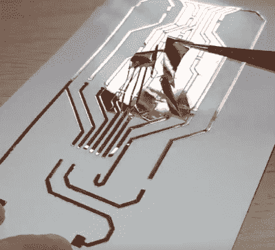

# 在家制作简单的玻璃电路板

> 原文：<https://hackaday.com/2019/12/01/creating-easy-glass-circuit-boards-at-home/>

这个在家里制作玻璃基板电路板的技巧可能比传统的 Hackaday 帖子更接近艺术和工艺，但[Heliox]在她最近的视频中展示的方法[的最终结果简直太棒了，不能忽视。该视频是法语的，但在 YouTube 的自动翻译尝试和我们亲爱的读者的强大精神力量之间，我们认为你在休息后跟上不会太难。](https://www.youtube.com/watch?v=jvw5OCUHaqc)

 简而言之就是[Heliox]装载了她的剪影 Cameo，这是一台电脑控制的切割机，通常用于纸张和乙烯基，用一张薄铜片粘附在背板上，给它一些机械强度。随着浮雕切割压力的降低，电路会从铜中被切割出来，但不会从下面的薄片中被切割出来，多余的部分可以小心地剥离掉。

然后，[Heliox]使用转印纸将铜迹线从纸上剥离，并将其粘在一片玻璃上。一旦它被弄平并按下，她就把转印纸拉掉，铜就留下了。

接下来，只需焊接 SMD 元件。为了更安全一点，她把玻璃的边缘打磨成圆形，但它仍然是玻璃，所以我们不推荐这种重型结构。虽然它可能不是你下一个版本的理想选择，但当它安装在支架上并像[Heliox]在结尾炫耀一样闪烁时，它看起来确实很棒。

具有讽刺意味的是，[与我们多年来见过的在家制作专业外观 PCB 的其他一些方法](https://hackaday.com/2016/09/18/vacuum-exposure-unit-gives-better-pcb-etching-results/)相比，这个方法实际上可能是最简单的方法之一。谁知道呢？

 [https://www.youtube.com/embed/jvw5OCUHaqc?version=3&rel=1&showsearch=0&showinfo=1&iv_load_policy=1&fs=1&hl=en-US&autohide=2&wmode=transparent](https://www.youtube.com/embed/jvw5OCUHaqc?version=3&rel=1&showsearch=0&showinfo=1&iv_load_policy=1&fs=1&hl=en-US&autohide=2&wmode=transparent)

【感谢詹姆斯的提示。]