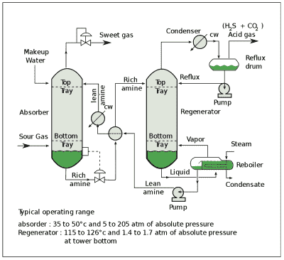
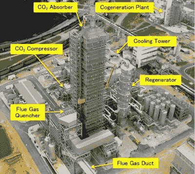
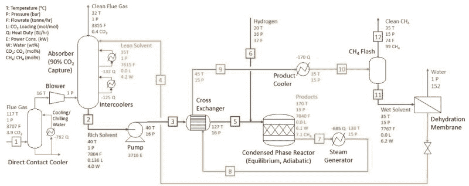

# 从捕获的二氧化碳中制造甲烷和碳捕获的未来

> 原文：<https://hackaday.com/2021/10/07/creating-methane-from-captured-carbon-dioxide-and-the-future-of-carbon-capture/>

关于碳(CO [2] 捕获的概念有一些本质上的简单:你简单地让 CO [2] 分子被某物吸收或吸附，之后你分离这样捕获的 CO [2] 并把它放在安全的地方。不幸的是，在物理和化学领域，看似简单明了的东西往往一点也不简单，更不用说节能了。虽然碳捕获的方法已经存在了几十年，但让它在经济上可行一直是个难题。

碳捕获和储存/封存( [CCS](https://en.wikipedia.org/wiki/Carbon_capture_and_storage) )以及碳捕获和利用( [CCU](https://en.wikipedia.org/wiki/Carbon_capture_and_utilization) )都是如此。前者寻求从大气中储存并理想地永久移除(隔离)碳，而后者捕获二氧化碳用于例如工业过程。

最近，太平洋西北国家实验室(PNNL)宣布了一项突破性的 CCU 概念，包括使用一种新的胺基溶剂(2-EEMPA)，这种溶剂不仅比以前常用的 T2 MEA(T3)更有效，而且可以在同一过程中直接产生甲烷。

由于甲烷是天然气的主要成分，这可能是 CCU 创造合成天然气碳中性来源(SNG)的一种方式吗？

## 简而言之，碳捕获

Process flow diagram of a typical amine treating process used in petroleum refineries, natural gas processing plants and other industrial facilities. (Credit: Raminagrobis, CC BY-SA 4.0)

最常见的碳捕获(CC)系统是用于化石燃料发电厂或类似烟道气来源的 CO [2] 洗涤器。这种气体被引导通过液体溶剂，通常是基于[胺](https://en.wikipedia.org/wiki/Amine)的。胺是氨的衍生物，其三个氢原子中至少有一个被取代基取代。[单乙醇胺](https://en.wikipedia.org/wiki/Ethanolamine)(C[2]H[7]NO，MEA )是一种伯胺，在水基溶液中能高效吸收烟气中的 CO [2] 和 H [2] S。

当生成的富含 CO [2] 的胺溶剂被导入再生器单元，在 69 kPa 下将该富含 CO[2]的胺溶剂加热至约 118°C 时，会导致吸收发生逆转并释放出气体。大部分 MEA 以这种方式回收，然后可以返回以从烟道气中吸收更多的 CO[2]。

MEA 的问题包括溶剂中的高含水量。水的比热很高，这意味着它需要大量的能量才能变热。MEA 还与硫化羰(COS)和二硫化碳(CS [2] 反应，形成热稳定盐，这将 MEA 从工艺中去除，并需要额外的工艺步骤来去除。

以这种方式捕获二氧化碳气体后，通常会在运输使用、储存或封存前进行压缩。在再生过程中加热富胺溶剂以及压缩捕获的二氧化碳都需要消耗大量的能量。这是 CC 的经济性不太有利的地方，并且优选已经富含要被捕获的气体的输入气体。

Mitsubishi Heavy Industries CO2 capture plant at the EOR project in Texas, USA. (Credit: Hirata et al. (2018), MHI)

多年来，已经开发了各种需要较少水的 MEA 替代物，以及省略或减少压缩步骤的方法。前者的例子有壳牌公司的 Cansolv 捕获技术和三菱重工的 KM CDR 工艺(T2)及其专有的 KS-1 溶剂。这些都有相同的目标:使用更少的水，减少排放到大气中的烟气中胺溶剂的量，提高溶剂的回收率，同时降低能源需求。

然而，这些方法都不适合直接空气 CCS。虽然从技术上讲，人们可以引导大气通过这些捕集设备之一，但空气中的 CO [2] 含量与烟道气中的差异非常大(>烟道气中为 9%，空气中为 0.04%)，导致效率等级非常低。

即便如此，对于烟气，CO [2] 的捕集率一般在 90%以上，但<为 99%(据称 Cansolv 为 98%，KM CDR 为> 90%)。这意味着尽管大部分的二氧化碳确实被捕获了，但是其中的一部分仍然会随着烟道气和胺溶剂一起排放出去。

## pnnl S2-eempa

在 PNNL 由 [Heldebrant 等人](https://chemistry-europe.onlinelibrary.wiley.com/doi/abs/10.1002/cssc.202101590) (2021)撰写的题为*的论文中，使用贫水、燃烧后的 CO [2] 捕集溶剂*将 CO [2] 集成捕集并转化为甲烷，提出了许多主张:

*   捕获的 CO [2] 转化为碳氢化合物(主要是甲烷)的转化率> 90%。
*   比通常的[萨巴蒂埃过程](https://en.wikipedia.org/wiki/Sabatier_reaction)更有效率(跳过 CO [2] 压缩&运输步骤)。
*   工艺条件为 170°C 和<15 bar H [2] 压力，使用[钌](https://en.wikipedia.org/wiki/Ruthenium)催化剂。
*   2-EEMPA 的性能优于 MEA。

这个过程包括许多步骤，从吸收二氧化碳到使其与添加的氢气反应生成碳氢化合物。Heldebrant 等人首先描述了萨巴蒂埃工艺，使用装备有壳牌 Cansolv(使用 50 重量%胺溶剂)工艺的联合循环天然气涡轮设备作为例子:

1.  二氧化碳 [2] 在吸收器&中被捕获，在 2 巴的压力下在汽提塔(再生器)中被释放。
2.  纯 CO [2] 被压缩并与氢气混合。
3.  将混合物加入甲烷化反应器进行萨巴蒂埃反应。
4.  萨巴蒂埃反应在 350℃和 30 巴下进行，使用安如/铝催化剂。
5.  放热反应为汽提塔单元和发电提供热量。

PNNL 的版本没有使用专有的 Cansolv 工艺，而是使用自己的 2-ee MPa(N-(2-乙氧基乙基)-3-吗啉代丙-1-胺)。Heldebrant 等人声称煤衍生烟道气的 CO [2] 捕集效率为> 95%。预计 2-EEMPA 基溶剂在操作中的含水量约为 4%(重量)。在这种水比率下，当引入氢气并且存在安如/Al[2]O[3]催化剂时，由 2-EEMPA(作为 ee MPa-氨基甲酸酯)捕获的 74%的 CO[2]转化为烃。其中 92%是甲烷。

在相同条件下，MEA 显示出对烃的转化率< 20%。整个流程链可总结如下图所示:

Proposed FG-to-SNG process with the IC3M technology. (Source: Heldebrant et al. (2021))

与传统的萨巴蒂埃工艺相比，其优势在于反应温度更低(170°C 而非 350°C)、压力更低(15 巴对 30 巴)以及建造和维护设备的成本更低。

## 外部因素的故事

正如本文前面提到的，碳捕获的一个主要考虑因素是过程的效率。如果我们认为此处提出的 CCU 依赖于丰富的 CO [2] 来源，以及纯氢来源，那么前者似乎必须来自烟道气和来自化石燃料工业的类似废物流。对于后者，如果我们不想制造额外的浪费，事情就更成问题了。

目前市场上几乎所有的氢气都是通过天然气的蒸汽转化(SMR)生产的。这使得它不是碳中性的:如果它需要天然气作为 SMR 的输入来制造 SNG 所需的氢气，人们也可以直接使用天然气。

Howarth 等人最近的研究进一步阐明了这一点，他们的研究详细介绍了所谓的“蓝色氢”的有效性，这种氢使用含天然气 SMR 的 CCS，并得出直接燃烧天然气更有效的结论。这就只剩下所谓的“绿色”氢气作为 SNG 过程的可行输入，可以想象它会成为碳中性的。

2020 年，全世界只有 4%的氢是通过电解产生的，其中一些来自低碳能源。即使这些 SNG 生产设施中的所有氢气都来自由 VRE 或核能供电的电解设施，这仍然会使二氧化碳成为一个问题。如果这来自化石燃料，那么它只是将碳进入大气的时间推迟到 SNG 燃烧的时候。

真正的碳中性燃料是可以想象的，但是到目前为止还没有找到可行的碳源。烟道气中的碳成本约为每吨 7.5 美元，从海水中提取碳作为碳酸的成本约为每吨 50 美元，直接空气碳捕获成本在每吨 94 至 232 美元之间。这就使得 PNNL 的工艺主要作为一种两次利用化石燃料(煤或天然气)中的碳的方法，尽管这需要相当大的能源投资。

## 没有免费的午餐

鉴于这些考虑，也基于 PNNL 自己的新闻稿，使用这种方法生产甲烷的能力似乎很明显是过渡性的，以支持向低碳方式过渡，为现代世界提供动力。唯一可能的例外可能是地外勘探，在那里就地资源利用([【ISRU】](https://en.wikipedia.org/wiki/In_situ_resource_utilization))可能会成为一件大事。

SpaceX 飞往火星的猛禽火箭发动机使用甲烷燃料的原因之一是，即使在火星表面这样的地方，甲烷也能相对容易地产生。当地球上最近的甲烷源突然在一个星球之外时，即使是 DACC 和电解水来慢慢产生一股甲烷燃料用于返程或维持一个殖民地的电力和其他成本似乎也不再令人吃惊。

像 2-EEMPA 这样的贫水溶剂的一个主要好处也可能是在化石燃料工厂更有效地捕获 CO [2] 。这是否足以让像 MHI 和壳牌这样的大公司坐起来关注，仍然是任何人的猜测，但很难否认化石燃料电厂更高效的 CCS 的好处。