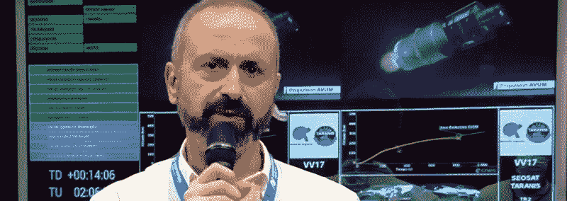
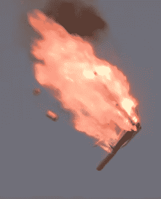

# 交叉线坠毁火箭

> 原文：<https://hackaday.com/2020/12/03/crossed-wires-crash-rockets/>

11 月 17 日，一枚载有两颗地球观测卫星的织女星火箭从法属圭亚那发射升空。助推器，巧合的是第 17 次织女星飞行，表现完美:组成其前三级的固体推进剂火箭发动机连续燃烧。但在织女星的第四级点燃其液体燃料的 RD-843 发动机后不久，很明显事情非常不对劲。虽然遥测显示发动机按预期运行，但车辆的轨迹和加速度开始偏离预期值。

对于不经意的观察者来说，没有什么戏剧性的时刻会表明助推器失败了。但是，当任务时钟到达 12 分钟时，不可否认的是，飞行器无法进入预定轨道。当直播主持人继续赞美织女星火箭及其携带的科学有效载荷的优点时，他们身后的屏幕显示任务注定要失败。

Displays behind the hosts clearly showed Vega wasn’t following the planned trajectory.

不幸的是，在太空飞行方面几乎没有犯错的余地。尽管达到了大约 250 公里(155 英里)的峰值高度，织女星的姿态游标上部模块(AVUM)未能保持达到轨道所需的速度和方向。最终，AVUM 及其携带的两颗卫星坠落回地球，据报道，撞击了距离第三级预计坠落地点不远的一个无人居住的地区。

尽管我们在这方面已经做得很好了，但是进入太空仍然非常困难。这是一个不可避免的现实，火箭偶尔会失败，它们的有效载荷会丢失。然而，织女星在这么多年里经历了两次失败这一事实有些令人不安，尤其是因为该助推器迄今只执行了 17 次任务。88%的成功率并不可怕，但肯定是在范围的低端。相比之下，联盟号、猎鹰 9 号和阿特拉斯等助推器的成功率为 95%或更高。

进一步的失败可能会削弱客户对相对较新的火箭的信任，这种火箭从 2012 年开始飞行，正面临商业发射提供商的激烈竞争。如果织女星要成为运营商阿丽亚娜航天公司所希望的欧洲主力，找出这次发射中的错误并确保它不再发生是最重要的。

## 混合转向

几个小时内，阿丽亚娜航天公司和欧洲航天局(欧空局)已经对飞行器的丢失展开了调查。这些调查通常需要几周甚至几个月才能得出结论，但在这种情况下，公众不需要等那么久。第二天，[阿丽亚娜航天公司发布了一份新闻稿，解释说 RD-843](https://www.arianespace.com/press-release/loss-of-vega-flight-vv17-identification-of-source-of-anomaly-and-establishment-of-inquiry-commission/) 的推力矢量控制(TVC)系统的一个问题导致 AVUM 在升空大约八分钟后失控坠落。

Vectoring the Space Shuttle’s RS-25 Engine

在与记者的通话中，阿丽亚娜航天公司的首席技术官 Roland Lagier 进一步解释说，调查人员认为，连接两个 TVC 致动器的电缆在 AVUM 的总装过程中被错误地调换了。最终结果是，发动机喷嘴的运动与航空电子设备的命令相反，当机载系统试图纠正这一问题时，情况只会变得更糟。

他澄清说，AVUM 或其 RD-843 发动机没有内在问题，这只是一个没有及时发现的错误，“这显然是一个生产和质量问题，一系列人为错误，而不是设计问题。”因此，解决方案将是更严格的装配后检查，并可能改变布线，使其难以或不可能在未来重复同样的错误。

ESA 仍然需要验证 Arianespace 内部调查的结果，但据传，在组装期间拍摄的 AVUM 的特写图像从视觉上证实了理论致动器的接线不正确。虽然这显然是一个令人尴尬的疏忽，但能够将失败归咎于人为错误意味着即将到来的织女星发射可能会按计划进行。

## 此面向上

在这一点上可能感到似曾相识的读者可能还记得 2013 年由于非常相似的情况而失败的俄罗斯质子-M 火箭。在这种情况下，一名工人错误地将几个角速度传感器安装颠倒，给助推器的航空电子设备提供了无效数据。由于对这种位置信息冲突的可能性毫无准备，飞行控制系统试图通过命令 TVC 系统进行一系列越来越激进的机动来纠正这种情况。

Proton-M rocket disintegrating before impact.

在升空后 23 秒，质子-M 已经完全倒转并指向下方。不幸的是，飞行终止系统的设计使得第一级发动机不能在飞行 40 秒前关闭。这个功能是为了在提前中止的情况下帮助确保车辆完全离开发射中心，但在这种情况下，这意味着飞行控制人员只能眼睁睁地看着火箭以最大功率冲向地面。

调查人员检查了碎片，并确认有问题的角速度传感器清楚地标有指示适当安装方向的箭头。此外，它们的形状是有意设计的，安装不正确是非常困难的。事实上，安装它们时用了太多的力，以至于在安装过程中发现它们所连接的安装板已经损坏。

尽管有这些明确的警告，但被分配任务的初级技术人员没有提醒他的上级注意这个问题。在技术人员的主管和质量控制专家进行检查时，这个错误也没有被发现，可能是因为传感器已经通过了电气连接测试。该系统可以检测传感器何时没有正确布线，但它不是为了验证它们产生的数据而设计的。

## 人的因素

虽然我们还不知道是谁负责连接织女星 AVUM 的 TVC 系统，但听说是另一名初级技术人员负责这项被认为很简单的任务也就不足为奇了。不幸的是，在建造轨道火箭时，没有简单的任务。当倒计时器到达零时，价值数亿美元的设备，甚至可能是人的生命都岌岌可危。

这两起事件都提醒人们，当涉及到航天飞行时，即使是最小的错误也可能造成灾难性的后果。在质子-M 失败后，俄罗斯政府不得不对每一枚火箭的制造和质量控制过程进行全面审查。欧空局肯定会对织女星的建造过程进行类似的审查，尽管现在说他们可能会对现有程序提出什么样的改变和修改还为时过早。

最终，欧洲航天局的反应可能取决于错误连接 TVC 致动器的难度。只有到那时，他们才能知道织女星是被简单的事故还是重大疏忽拖垮的。