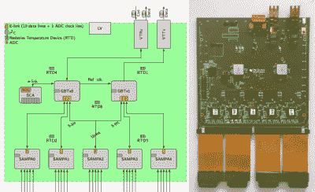
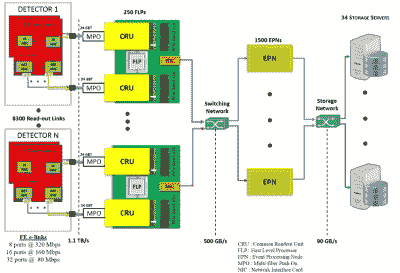
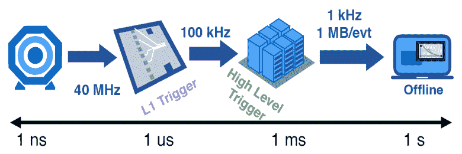
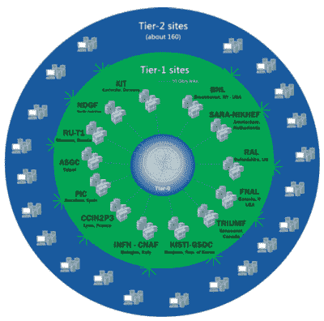

# 处理来自大型强子对撞机的海量数据

> 原文：<https://hackaday.com/2020/05/14/crunching-giant-data-from-the-large-hadron-collider/>

现代物理实验通常是复杂的、雄心勃勃的和昂贵的。通过在你的实验室里进行一个小的桌面实验来取得科学进步的时代已经过去了。尤其是在天体物理学或粒子物理学领域，你需要大型望远镜、昂贵的卫星任务或由成百上千人参与的国际合作运行的巨型对撞机。为了说明这一点:人类建造的最大的机器是大型强子对撞机(LHC)。听到即使仅仅管理它产生的数据也是一项超级大的任务，你不会感到惊讶。

自 2008 年启动以来，欧洲粒子物理研究所的 LHC 已经接受了几次升级，以保持技术的前沿。目前，该机器正处于第二次长时间关闭，并准备在 2021 年 5 月重新启动。Run 3 的改进之一将是以更高的速度进行粒子碰撞，由所谓的光度量化。这使得实验能够收集更多的统计数据，并更好地研究罕见的过程。2024 年底，LHC 将升级为[高亮度 LHC](https://home.cern/science/accelerators/high-luminosity-lhc) ，其亮度将比 LHC 的原始设计值提高 10 倍。

目前，ALICE、ATLAS、CMS 和 LHCb 等主要实验正在准备应对每秒万亿字节范围内的预期数据速率。现在是研究现代高能物理实验的数据获取、存储和分析的更详细信息的最佳时机。

## 爱丽丝的主要升级

爱丽丝实验是实验中的异类，因为它研究的是铅-铅碰撞，而不是质子-质子碰撞。它还面临着升级的最大挑战之一，因为在即将到来的 LHC 运行中，观察到的碰撞率将从 1 kHz 增加到 50 kHz，增加 50 倍。以 5 MHz 的采样速率读取约 50 万个探测器通道，这相当于约 3 TB/s 的连续数据流。

New front end electronic boards for the ALICE TPC
Credit: [C. Lippmann](https://indico.cern.ch/event/673073/contributions/2770227/attachments/1554649/2446360/SAMPA_171109.pdf)

为了应对这些数字，ALICE 的主探测器，一个时间投影室(TPC)，接收了 3276 个由橡树岭国家实验室开发的新[前端电子卡。主板的核心是圣保罗大学设计的一个名为](https://www.ornl.gov/news/major-upgrades-particle-detectors-and-electronics-prepare-cern-experiment-stream-data-tsunami) [SAMPA](https://www.eurekalert.org/pub_releases/2018-04/fda-cdb041718.php) 的定制 ASIC。SAMPA 芯片包括一个电荷敏感放大器、一个 10 位 ADC 和一个数字信号处理(DSP)单元。在设备上做 DSP 已经可以通过[消零](https://en.wikipedia.org/wiki/Zero_suppression)把数据降到~1 TB/s。

因为前端电子设备直接位于探测器上，它们必须应对高剂量的辐射。因此，CERN 很早就开始开发[千兆位收发器(GBT)平台](http://cds.cern.ch/record/1235836)，这是一种定制的 ASIC 和数据传输协议，提供了一种耐辐射的 4.8 Gbit/s 光链路，现在被几个 LHC 实验所使用。

ALICE data acquisition and storage scheme
Credit: [J. Mitra et al.](https://iopscience.iop.org/article/10.1088/1748-0221/11/03/C03021/pdf)

如示意图所示，来自 ALICE 前端电子设备的数据被传输到公共读出单元(CRU ),作为一级处理器(FLP)的接口。FLP 是一个服务器群，它通过将检测器命中分组为群集来将数据缩减至约 500 GB/s。CRU 板基于 Altera Arria 10 GX FPGA，并使用商用 PCI-Express 接口，因为它具有成本效益，可广泛用于服务器机器。数据合并和最终的数据量缩减由第二台计算机执行:事件处理节点(EPN)将数据流减少到大约 90 GB/s，然后存储到磁盘。

事件处理过程中最耗时的步骤是重建粒子轨迹。当其他大型强子对撞机实验仍然使用常规多核 CPU 来完成这项任务时，爱丽丝正在设计他们的跟踪实现，以在 GPU 上运行，这大大提高了 offer 的并行计算能力。[一项研究显示](https://www.epj-conferences.org/articles/epjconf/abs/2019/19/epjconf_chep2018_01050/epjconf_chep2018_01050.html)与英特尔 i7-6700K 处理器相比，英伟达 GTX 1080 的寻道速度快了 40 倍。有趣的是，ALICE TPC 的跟踪算法是基于细胞自动机的。

## 多级触发、机器学习和量子计算

虽然 ALICE 实验将能够从所有发生在 50 kHz 的 Pb-Pb 碰撞中连续传输数据，但其他 LHC 探测器的质子-质子碰撞率高达 40 MHz。因此，这些实验采用多级触发方案，只读出预选的事件。例如，CMS 实验使用基于 FPGA 的一级触发器，可以在几微秒内过滤数据。第二阶段的高级触发器(HLT)使用商用 CPU 通过软件处理数据，允许毫秒级的较长延迟。

Triggering scheme for the CMS experiment
Credit: [A. Castaneda](https://indico.cern.ch/event/687651/contributions/3427643/attachments/1849430/3036967/LHC2019_MLBigData_final.pdf)

HLT 负责轨迹识别，这是一项目前正在向实现机器学习技术发展的任务。2018 年，CERN 举办了 [TrackML 竞赛](https://sites.google.com/site/trackmlparticle/)，挑战人们建立一种快速重建粒子轨迹的机器学习算法。 [HEP 采用了一种更为雄心勃勃的方法。QPR 项目](https://hep-qpr.lbl.gov/)正在为量子计算机开发追踪算法，因为这些算法有可能克服[组合爆炸](https://en.wikipedia.org/wiki/Combinatorial_explosion)的问题。他们已经使用 D-Wave 公司在 TrackML 数据集上测试了他们的算法，该公司正在为他们的量子计算机提供云服务。

虽然寻道算法可以在 CPU 或 GPU 上轻松运行，但一级触发器所需的低延迟和 FPGAs 的有限硬件资源仅允许非常基本的算法用于数据选择。更复杂的算法可以帮助保存目前丢失的潜在有趣的物理签名。出于这个原因，费米实验室的研究人员开发了 [hls4ml](https://fastmachinelearning.org/hls4ml/) 编译器包，它将机器学习模型从常见的开源软件包如 [Keras](https://keras.io/) 和 [PyTorch](https://pytorch.org/) 翻译成 FPGAs 的寄存器传输级(RTL)抽象。

## 网格上的数据分析

The Worldwide LHC Computing Grid
Credit: [A. Castaneda](https://indico.cern.ch/event/687651/contributions/3427643/attachments/1849430/3036967/LHC2019_MLBigData_final.pdf)

机器学习已经广泛用于存储数据的离线分析，特别是用于粒子识别。一个例子是 b 标记，它指的是识别对新物理搜索很重要的来自底夸克的事件。目前，最有效的 b 标记算法是基于深度神经网络的，如 CMS 开发的 [DeepCSV](https://twiki.cern.ch/twiki/bin/view/CMSPublic/BTV13TeVDPDeepCSV) 算法。

你可能听说过[全球 LHC 计算网格](https://en.wikipedia.org/wiki/Worldwide_LHC_Computing_Grid) (WLCG)，数据分析通常在这里进行。它由分布在 40 多个国家的大约 170 个计算中心组成，总共有大约 100 万个 CPU 内核和 1 EB 的存储空间。也许不太为人所知的是，超过 50%的 WLCG 工作量是由蒙特卡罗模拟来表示的。这些碰撞的“假设”模型是数据分析的关键部分，需要优化事件选择标准。

尽管许多人可能对 LHC 没有导致超对称性等新物理的发现感到失望，但数据中仍有一些持续存在的异常现象。即使即将到来的 LHC 升级将揭示这些仅仅是统计波动，CERN 将继续成为电子、计算和数据科学领域新技术的驱动力。