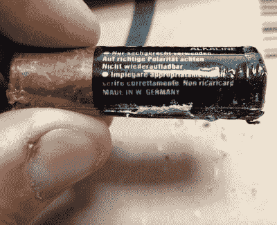
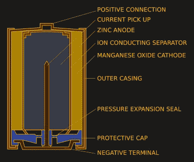
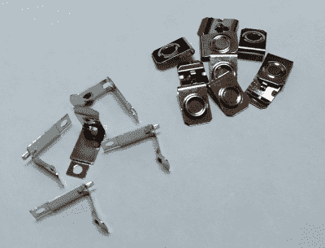

# 硬壳泄漏细胞杀死你的技术。到底发生了什么事？

> 原文：<https://hackaday.com/2022/10/19/crusty-leaking-cells-kill-your-tech-just-whats-going-on/>

多年来，经验丰富的黑客读者可能已经注意到，我们中的一些人在 Jolly Wrencher 的标志下辛勤工作，却对旧技术情有独钟。毕竟，有什么不喜欢几十年前的一件非常便宜的消费电子产品，只是乞求一点硬件黑客？对我来说，目前这体现在选择 8 毫米电影摄像机，因为我追求一个项目，最终将提供一个体面的质量数字胶片卡盒。

## 当一个细胞来自西德，你知道它是旧的

“Made in West Germany”

在旧货店里寻找一项 40 年前就被取代的技术的麻烦在于，我找到的相机在大多数情况下都是从 20 世纪 80 年代初就放在抽屉里的。在过去，它们是很有价值的物品，所以它们当然被保留了下来，然后它们被遗忘了，直到有一天，曾经是家庭电影中的孩子的成年人正在清理房子，他们开始了他们的旅程，来到我的长椅上。

问题是，很少有 8 毫米相机的拥有者有明智之举，在把电池收起来之前先把它们取出来，所以我最终不可避免地得到了一个装满 20 世纪 80 年代坚硬的金霸王电池和生锈的隐形眼镜的电池盒。这让我很好奇，这里到底发生了什么，我该如何解决？

## 有什么漏的东西？

Construction of a zinc-manganese “alkaline” cell. Tympanus, [Public domain](https://commons.wikimedia.org/wiki/File:Alkaline-battery-english.svg).

不可充电电池有多种化学成分，但我们最熟悉的商用电池是锌碳“干电池”和“碱性”锌锰电池。锌碳电池在 2022 年将变得不太常见，并具有酸性氯化锌或氯化铵电解质，而碱性电池具有更高的容量和碱性氢氧化钾电解质。它们都有不同的故障模式，会导致电池泄漏，因此值得逐一查看。

锌碳电池的失效模式是一种化学模式，酸性电解质与锌罐阳极发生反应，并最终腐蚀它。然后，泄漏的电解液会侵蚀周围的电路和电池夹。这算不上是浓缩酸，但多年来足以造成大量伤害。

同时，碱性电池在降解过程中会积累氢气。它包含一个通风口，允许氢气逸出，但是氢气压力反而会迫使电解液通过该通风口排出。电解液会腐蚀电池端子和其他接触到的电子设备。碱性电池泄漏的一个特征是白色外壳，这是氢氧化钾电解液与空气中的二氧化碳反应形成的碳酸钾。

## 拯救世界的全球零件箱

Fresh and new battery clips for AA holders

损坏程度通常取决于电池在设备中的使用时间。有时运气好的话，电池触点还可以挽救，否则就太远了，必须找到替代品。过去的我尝试了各种使用硬铜线和其他材料的自制解决方案，但今天由于国际商业的奇迹，通常可以找到与旧触点相同或非常相似的触点。在全球速卖通上快速搜索诸如“ [AA 电池弹簧](https://www.aliexpress.com/wholesale?SearchText=AA+battery+spring)”这样的词，将会返回许多选项，然后只需翻页就能在你喜欢的词上找到你需要的那个。

所以那些喜欢复古技术的人会在最后几段中发现一些熟悉的东西，但在处理古代电池时会发现一个教训。到 2022 年，我们的消费电子设备中更有可能会有锂聚合物电池，因此手边放一堆金霸王电池的需求会减少。但是，想到今天的超级 8 相机被遗忘在抽屉里几十年，里面有一个廉价的锂电池，远比有一些硬皮锰电池的东西更可怕。我们刚刚找到 21 世纪 40 年代房屋火灾的根本原因了吗？