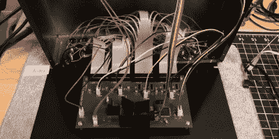

# 定制的 12 端口 A/V 开关使 CRT 保持良好的供电

> 原文：<https://hackaday.com/2021/03/30/custom-built-12-port-a-v-switch-keeps-crt-well-fed/>

喜欢在真实硬件上玩游戏的经典游戏爱好者知道将他们几十年前的游戏机连接到现代电视上的困难。这就是为什么许多游戏玩家选择保留一台当代 CRT 电视，以便在回忆往事时使用。不幸的是，这些旧电视通常不会在背面提供超过几个 A/V 端口，所以你可能需要投资一个 A/V 开关来保持它们同时连接。

这就是[托马斯·索维尔]发现自己的处境，只是他找不到一个有足够港口的港口。他决定建造自己定制的 12 端口控制台选择器，而不是将交换机链接在一起。集成的放大器让一切看起来都很清晰，漂亮的胡桃木和金属外壳，以及光滑的图形界面，在真空荧光显示器(VFD)上显示当前选择的控制台的徽标，最终产品是一个经典的游戏玩家梦想成真。

A peek under the hood.

为了切换音频，[Thomas]使用一对 ADG1606 16 通道模拟多路复用器，而视频则通过四个 MAX4315 8 通道视频多路复用放大器进行混洗。乍一看，数学可能有点复杂，但他为每个立体声通道使用一个 ADG1606，由于开关用于 S-Video，每个器件都有需要单独处理的亮度和颜色信号。多路复用器通过 ATmega2561 微控制器翻转，该微控制器还负责从外壳正面的旋转编码器读取用户输入，并在 140×32 Noritake VFD 上显示适当的控制台徽标。

你可能会惊讶地发现，当[托马斯]开始这个项目时，他认为自己是一个电子初学者，而这只是他设计的第二块 PCB。这是一个大胆的第二个项目吗？当然可以。但这也说明了 DIY 电子产品在过去几年里已经走了多远。[强大的开源工具](https://hackaday.com/2021/02/04/feeling-the-kicad-6-electricity/)、模块化组件，当然还有一个愿意分享他们的知识和设计的创意社区，已经在重新定义[个人黑客和制造者的可能性](https://hackaday.com/2021/03/27/homebrew-68k-micro-atx-computer-runs-its-own-os/)方面走了很长的路。

 [https://www.youtube.com/embed/lbP0ReIGSx0?version=3&rel=1&showsearch=0&showinfo=1&iv_load_policy=1&fs=1&hl=en-US&autohide=2&wmode=transparent](https://www.youtube.com/embed/lbP0ReIGSx0?version=3&rel=1&showsearch=0&showinfo=1&iv_load_policy=1&fs=1&hl=en-US&autohide=2&wmode=transparent)

