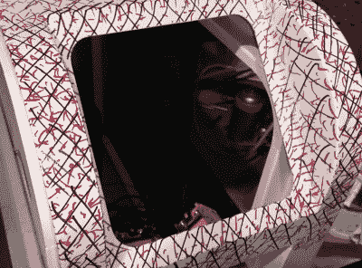

# 带摄影测量的定制控制面板

> 原文：<https://hackaday.com/2019/12/26/custom-control-panels-with-photogrammetry/>

桌面 3D 打印的最佳应用之一是创建一次性定制组件。大多数情况下，一把还算过得去的卡尺和一些耐心就可以制作出你想要的零件，但是有时候事情会变得非常复杂，你可能需要一些帮助。如果你发现自己处于这种情况，拯救可能就在几个标记符之外。

[正如[Mangy_Dog]在最近的视频](https://www.youtube.com/watch?v=7UTViK1cztQ)中解释的那样，他想为他一直在做的激光切割机制作一个控制面板模型，但认为所涉及的形状比他想手动解决的要多一些。所以他决定试试摄影测量学。对于外行来说，这个过程包括从多个角度拍摄尽可能多的给定物体的高分辨率图像，并让计算机将其拼接成三维模型。他推断，如果他有一个激光器现有前面板的 3D 模型，就可以很容易地为它 3D 打印一些替换零件。

 这本身就是一个足够简洁的技巧，但我们特别喜欢这个视频的是[Mangy_Dog]传递的关于增加视觉复杂性以改善最终结果的提示。基本上，该软件正在寻找可识别的表面细节来拼凑，所以你可以像一个蹒跚学步的孩子一样，通过使用一些不同颜色的标记在整个表面上画画来使事情变得简单一些。这可能看起来很疯狂，但所有这些线条给了软件一些定位点，帮助它理清形状的细微差别。

不幸的是，这些标记最终比[癞皮狗]希望的更持久，他最终不得不使用丙酮来去除污渍。一定要记住这一点。但最终，生成的 3D 模型足够精确，以至于(经过一点缩放)他能够设计一个新的面板，就像它是一个工厂组件一样弹出。

Hackaday 的读者可能还记得，当我们最后一次听到[Mangy_Dog]的消息时，他正在对他令人难以置信的“Playdog Blackbone”手持游戏系统进行最后的润色，这本身就是 3D 打印组件与现有硬件相结合的胜利。

 [https://www.youtube.com/embed/7UTViK1cztQ?version=3&rel=1&showsearch=0&showinfo=1&iv_load_policy=1&fs=1&hl=en-US&autohide=2&wmode=transparent](https://www.youtube.com/embed/7UTViK1cztQ?version=3&rel=1&showsearch=0&showinfo=1&iv_load_policy=1&fs=1&hl=en-US&autohide=2&wmode=transparent)

