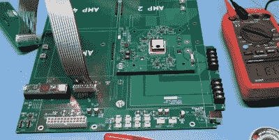

# 定制电子负载利用游戏电脑技术

> 原文：<https://hackaday.com/2020/10/18/custom-electronic-load-makes-use-of-gaming-pc-tech/>

乍一看，你可能会认为这里的硬件是一台现代游戏电脑。它有水冷、RGB LED 照明和 ATX 电源，所有这些恰巧都安装在一个华丽的电脑机箱内，配有一个透明的窗口。事实上，除了游戏电脑之外，很难将它视为其他东西。

事实上，这是一个令人难以置信的[定制电子负载，[EE for Everyone]在过去的四个月里一直在开发](https://github.com/eeforeveryone/ampere)，它是专门为利用高性能计算机的所有廉价硬件而设计的。毕竟，当网上有这么多现成的水冷却系统或外壳时，为什么要临时搭建呢？

The “motherboard” with single load module installed.

在那个别致的盒子里是一个大 PCB，取代了原来的主板，四个电子负载模块插入其中。这些负载中的每一个都设计为接受标准的英特尔 CPU 冷却器，无论是传统的散热器和风扇，还是用于液体冷却的水块。安装了当前的系统后,[EE for Everyone]可以在温度上升到不可接受的水平之前将单个模块的功率提高到 275 瓦，尽管他希望在未来的一些调整中可以将功率提高一点。

那么这里的最终游戏是什么？难道我们都被期望在长凳下藏着一个巨大的 RGB 照明的电子负载吗？不完全是。所有这些都是为业余爱好者设计高精度电子负载的努力的一部分，这个项目被称为“社区版”。这些较小的载荷将来自于在这个较大的试验台中使用的单独模块。

我们实际上已经在过去看到过 DIY 液体冷却电子负载，尽管这一次确实设置了更高的标准。对于那些要求更低的人，你可能会考虑[用开源固件](https://hackaday.com/2018/09/06/zpb30a1-electronic-load-gets-an-open-firmware/)刷新一个廉价的进口电子负载，以挤出一些额外的功能。

 [https://www.youtube.com/embed/iDHRyQ96f7M?version=3&rel=1&showsearch=0&showinfo=1&iv_load_policy=1&fs=1&hl=en-US&autohide=2&wmode=transparent](https://www.youtube.com/embed/iDHRyQ96f7M?version=3&rel=1&showsearch=0&showinfo=1&iv_load_policy=1&fs=1&hl=en-US&autohide=2&wmode=transparent)

 [https://www.youtube.com/embed/AAFIDkRhzGo?version=3&rel=1&showsearch=0&showinfo=1&iv_load_policy=1&fs=1&hl=en-US&autohide=2&wmode=transparent](https://www.youtube.com/embed/AAFIDkRhzGo?version=3&rel=1&showsearch=0&showinfo=1&iv_load_policy=1&fs=1&hl=en-US&autohide=2&wmode=transparent)

感谢赞的提示。]