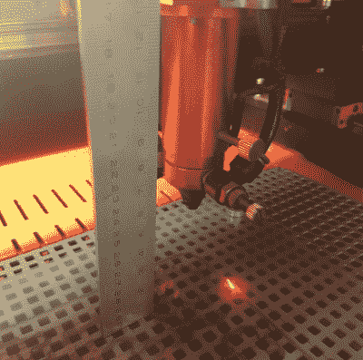

# 定制充气玩具只有一束激光

> 原文：<https://hackaday.com/2019/04/02/custom-inflatables-are-only-a-laser-beam-away/>

卡尔·萨根曾说过“如果你想从零开始做一个苹果派，你必须先发明宇宙。”这可能不是对烘焙相对难度的准确描述，但逻辑足够合理:在你达到最终目标之前，通常需要做很多基础工作。[ralph124c]希望最终创造的充气筏就是这一原理的完美例子；在他起航之前，他必须用他的激光切割机完美制作气球动物。

 从长远来看，这个筏子将由几片涂有 TPU 涂层的布料用热熨斗熔合在一起制成。但是在他花费时间和金钱建造真正的东西之前，他想做一些缩小规模的测试，以确保他的设计如预期的那样工作。他说了一句隐晦的话，说他从惨痛的教训中学到了充气机容易出现奇怪的行为，出于过分的谨慎，我们会相信他的话。

他希望用便宜得多的低密度聚乙烯薄膜来测试他的设计，但他发现热熨斗并没有像他希望的那样将它融合在一起。他想到了他的 60 瓦激光切割机，并想知道是否可以通过将功率调低到尽可能低并快速移动穿过材料来达到预期的效果。

他的第一次尝试要么直接穿透薄膜，要么什么也没做，但最终他有了一个聪明的想法，将激光从低密度聚乙烯移开。这使得光束无法聚焦，这不仅扩大了它覆盖的区域，而且减少了传递到表面的能量。通过更多的实验，他发现他能够将这些材料整齐地焊接在一起。他甚至发现，他可以稍微增加功率来切穿胶片，而不必调整激光焦点。凭借创造复杂充气形状的能力，也许[ralph124c]将创造出气球版的 Carl Sagan 或一个苹果派来庆祝。

当然，这项技术不仅限于生日气球和模型木筏。快速而轻松地生产定制充气形状的能力对任何从事软机器人工作的人来说都是一个巨大的福音，我们[甚至已经看到类似的概念应用于触觉反馈系统](https://hackaday.com/2018/03/22/what-we-need-to-try-in-haptic-hacks/)。

感谢亚瑟的提示。]