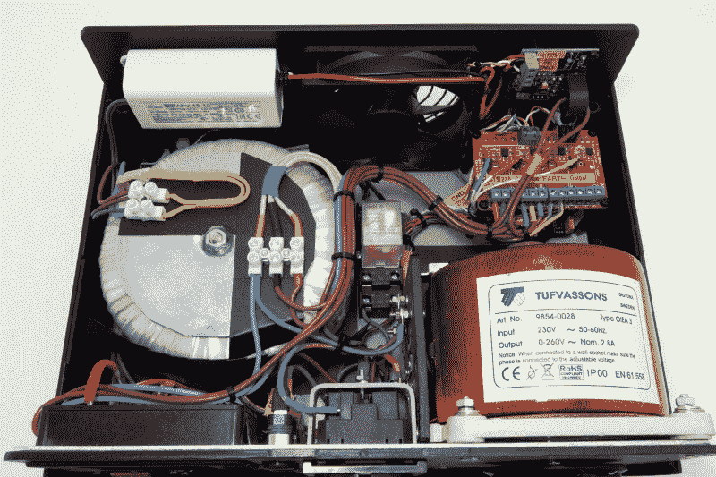

# 定制的隔离式自耦变压器是独一无二的

> 原文：<https://hackaday.com/2021/08/17/custom-isolated-variac-is-truly-one-of-a-kind/>

这并不奇怪，许多硬件黑客避免与 AC 合作，坦率地说，我们不能责怪他们。使用电源电压时出错的潜在后果远远大于摆弄 3.3 V 电路时可能发生的任何事情。但是如果你发现自己倾向于活泼的一面，明智的做法是给你的长椅配备合适的装备。

以[Lajt] 打造的这款[绝对华丽的可变隔离变压器为例。它可能*看起来*像一个高端的专业测试设备，但正如大量的报道和建造照片可以证明的那样，这是一个完全定制的工作。缺点是这台特殊的机器可能永远不会被复制，特别是考虑到它的隔离变压器是由当地一家公司委托制造的，但至少我们可以看着它做梦。](https://lajtronix.eu/2021/04/29/diy-variable-isolation-transformer/)

该设备结合了两种功能，在维修或测试交流硬件时特别有用。作为一个可变变压器，通常被称为自耦变压器，它让[Lajt]选择多少电压通过输出端。有一个学派认为，在测试一个旧的或可能损坏的设备时，慢慢增加电压比简单地把它插在墙上并抱最好的希望要好。或者，如果你喜欢艾迪·范·海伦，你可以用它来控制你的超大马歇尔放大器在酒吧演奏时的音量。

 其次，机组隔离了输出端。这样，如果你设法穿越错误的电线，你就不会突然打开断路器，让你的车间陷入黑暗。它还能防止你在四处打探时意外炸毁任何你可能使用的交流供电测试设备，[比如那台昂贵的示波器](https://hackaday.com/2014/11/26/scope-noob-probing-alternating-current/)，因为这些设备不会共享一个公共接地。

使用 Arduino Uno R3 克隆、电流传感器和几个继电器实现了额外的安全功能。如果电流达到预定阈值，系统将自动切断测试设备的电源，并拒绝重新启用主继电器，直到问题得到解决。代码以这样一种方式编写，每当用户进行配置更改时，电源将被切断，必须手动重新建立；给用户足够的时间来决定这是否是他们真正想要做的。

[Lajt]明确指出，这篇文章并不意味着是构建自己的教程，但这不应该阻止你通读它并获得一些想法。[无论你是想购买定制的自耦变压器齿尖](https://hackaday.com/2018/05/14/diy-variacs-get-esp8266-upgrades/)还是只想从一件设计完美的设备中获得灵感，这个项目肯定是一个高水准的标志。