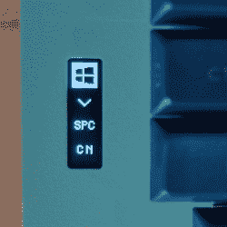

# 定制键盘拆分，变薄，获得染色木材

> 原文：<https://hackaday.com/2020/09/21/custom-keyboard-goes-split-gets-thin-acquires-stained-wood/>

实现 DIY 键盘所需的硬件和软件已经变得越来越容易获得，这意味着从头开始实现理想的输入设备比以往任何时候都更容易。对[卡梅隆·孙]来说，[他的省略号分离机械键盘构建日志](https://www.csun.io/2020/06/14/ellipsis-split-buildlog.html)详细描述了他的第二次努力，从第一次的经验教训中提炼出他最初的设计。新键盘很薄，分为两部分，集成了由染色木材制成的手腕支撑。油漆和木材处理花费了大量的工作和耐心，但它肯定得到了回报，因为结果看起来很惊人！

Small integrated OLED screen shows the current mode.

当我们看到[Cameron]的第一个定制键盘时，我们很欣赏它独特的铝制外壳和一些漂亮的触感，比如物理拨动开关。这些触觉开关允许将键盘切换到不同的模式，同时还可以作为视觉指示器。[卡梅伦]也喜欢这些开关，但可惜它们不适合新的超薄设计。然而，他非常喜欢在软件中切换模式，并使用小型有机发光二极管显示器作为指示器。他的键盘有什么样的不同模式？有 Windows 模式和 Mac 模式(改变一些热键)以及改变拇指簇中的哪些键做什么的模式(例如，向左移动空格键以更容易玩游戏)。)毕竟不是只有物理布局可以用 DIY 键盘定制的。

有兴趣制作自己的定制键盘吗？在开始之前，请务必了解一下[这种分离式键盘 PCB 概念](https://hackaday.com/2020/07/29/breakaway-keyboard-pcb-makes-customization-a-snap/)，因为它可能会让您的定制构建更加容易。