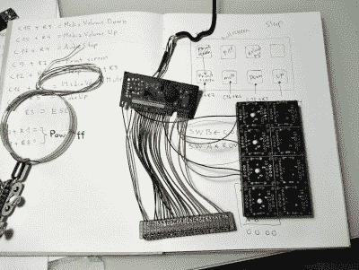

# 自定义宏键盘在木头上看起来不错

> 原文：<https://hackaday.com/2021/05/21/custom-macro-keyboard-looks-good-in-wood/>

[制作机械宏垫的方法不止一种，这个木制的奇迹代表了我们最喜欢的方法之一](https://hackaday.io/project/179512-custom-wooden-mechanical-keyboard)。[Tauno Erik]有一个旧的橡胶圆顶矩形键盘，仍然可以使用，但这个可怜的东西缺少了一些盖子。在抢救了控制器之后，[Tauno Erik]开始着手解决矩阵映射的繁琐工作，使用 Python 脚本可以使这项工作变得更容易。

 这款美的几乎每一个部件都是木头，包括安装板和那些又厚又可爱的键帽——它们的最上层是实心橡木，最底层是桦木胶合板。为了将键帽与开关连接起来，[Tauno Erik]设计并印刷了连接器部件，这些部件位于超大键帽内部，并接受按键开关的杆。

说到开关，我们不确定[Tauno Erik]最终是使用樱桃绿开关、棕色开关，还是两者混合使用(这将很有趣)，但每一个开关都安装在定制的 PCB 上，带有一个二极管和一个上拉电阻。你可以在[Tauno Erik]的网站上看到[更多的建造图片](https://taunoerik.art/2021/05/02/custom-wooden-mechanical-keyboard/),休息后留下来看看完工的建筑。

木头是制作键帽的绝佳选择，我们认为随着时间的推移和使用，它们只会看起来更好。木材在键盘上更常见的用途是令人惊讶的舒适的腕托。