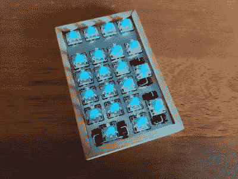

# 自定义数字键盘是宏键盘的两倍

> 原文：<https://hackaday.com/2021/06/08/custom-num-pad-does-double-duty-as-macro-pad/>

当你可以做一些新的漂亮的东西，开源坏男孩，成为社区的英雄时，为什么还要买 num pad 或 macropad 呢？我们认为这应该是你需要建造而不是购买的所有理由，即使你认为你的东西[只是[Clewsy]声称的另一个键盘[JAnK]](https://hackaday.io/project/180104-jank)。

 乍一看，JAnK 似乎是一个标准的数字键盘，顶部有四个宏按键。但是当你滚动你自己的棋盘时，所有的键都是可编程的。[Clewsy]利用了这一点，添加了第二层，可通过(还有什么？)Num Lock 键。这将 JAnK 切换到 21 键宏键盘模式。

[Clewsy]为此开发了他们自己的 PCB，并使用了久负盛名的 ATMega32u4，因为它具有 HID 和 USB 主机功能。每个按键都有背光，这些 LED 由 MP3202 LED 驱动器和 AVR 的 PWM 驱动。[Clewsy]能够通过从另一个版本的不锈钢按键开关板上锯下 num pad 来制造原型，但最终向 JAnK 订购了自己定制的激光切割不锈钢板。可爱的外壳是由斑点橡胶木和丙烯酸底座制成的。

事实证明，把所有这些放在一起有点问题。[Clewsy]焊接了最小可行的组件进行测试，发现 ATMega 的 VCC 和 GND 引脚都短路了。这杀死了 AVR 程序员，但不是芯片本身，而且[Clewsy]刚好有备用的。雪上加霜的是，Num Lock 灯不工作，但[Clewsy]能够简单地反转 LED，而不是订购一堆新的电路板。[在【Clewsy】的个人网站上查看详细的文章](https://clews.pro/projects/jank.php)，其中包含代码和大量图片。

这个版本令人惊叹的一点是，[Clewsy]能够重用来自[MAC r0 的代码，它最初是作为扫描按键矩阵的概念证明，后来成为音乐和媒体控制器](https://hackaday.com/2020/11/19/micro-macro-keyboard-is-mega-based/)。