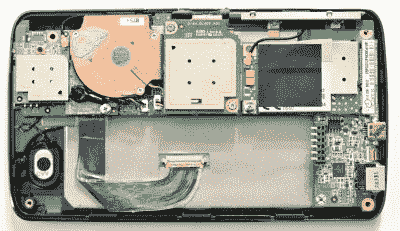

# 定制固态硬盘赋予手持式凌动电脑新的生命

> 原文：<https://hackaday.com/2022/02/25/custom-ssd-gives-new-life-to-handheld-atom-pc/>

人们通常不会像[张文婷]走得那么远——[为 2006 年生产的便携式 x86 计算机设计一款新的 IDE SSD 板](https://hackaday.io/project/184002-s6ssd)。也就是说，目睹数量惊人的逆向工程和设计工作被轻易放弃令人瞠目结舌。

明基 S6 是一款小型 MID(小型化互联网设备),配有 Atom CPU，除了外观之外都是 x86 机器。然而，它的非标准 SSD 的 2g 存储空间严重限制了操作系统的选择——Windows XP 几乎不适合在那里，尽管一个小的 Linux 发行版可以管理得更好，但它“不那么令人兴奋”。许多人会在那里停下来，使用外部驱动器，或者一堆适配器，从而需要对外壳进行难看的修改——[文婷]更进一步，在他的设计之旅中打破了“一堆适配器”的刻板印象。

 将多个复杂的多层板追踪到一个统一的工作原理图绝非易事，尤其是 SSD PCB 是两个 BGA 芯片的主机，并且考虑到笔记本电脑原始驱动器的 IDE 接口中的大量引脚。甚至 SSD 需要初始化的要求也没能阻止他——随后与制造商的软件进行了一场短时间的斗争，但不是[文婷]技能的对手。最终结果是一个比普通固态硬盘更薄的替代固态硬盘。

这个项目有据可查，值得我们所有人学习！源代码和 PCB 文件都在 GitHub 上，【文婷】同时在三个不同的地方报道了这段旅程——在 Hackaday.io 上，在[下面嵌入的一个 YouTube 视频](https://www.youtube.com/watch?v=9gF4EriSAQ0)中，还有[在他的 Twitter 上以常规帖子的形式](https://twitter.com/zephray_wenting)。现在，看到这种情况发生，我们都少了一个借口去着手一个看似如此复杂的项目。

黑客们时不时地进行 SSD 升级和再利用，有时[设计专有的 SATA 适配器](https://hackaday.com/2011/03/08/ssd-flex-connector-to-sata/)，有时[重用定制的 SSD 模块](https://hackaday.com/2018/11/08/steady-hand-repurposes-cheap-ssd-modules/)我们已经设法获得了一堆。如果你从美学角度来看可以接受 case mods，我们已经看到[为 Surface Pro 3](https://hackaday.com/2015/04/28/upgrading-a-microsoft-surface-to-a-1-tb-ssd/) 进行的 SSD 升级以这种方式成为可能。

 [https://www.youtube.com/embed/9gF4EriSAQ0?version=3&rel=1&showsearch=0&showinfo=1&iv_load_policy=1&fs=1&hl=en-US&autohide=2&wmode=transparent](https://www.youtube.com/embed/9gF4EriSAQ0?version=3&rel=1&showsearch=0&showinfo=1&iv_load_policy=1&fs=1&hl=en-US&autohide=2&wmode=transparent)

