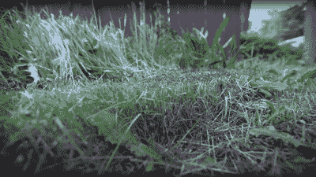

# 用该死的激光割草

> 原文：<https://hackaday.com/2022/09/02/cutting-the-grass-with-frickin-lasers/>

比起冬天在院子里劈柴，我们这些技术型的人常常在键盘前敲代码要舒服得多，甚至像割草这样的小事有时也太像我们喜欢的体力劳动了。显而易见的解决方案是机器人割草机，但它们有点无聊，有着低技术含量的旋转金属刀片。我们需要一个大的激光器。YouTuber [rctestflight]一直在试验使用 40W 蓝色二极管激光模块来割草，(视频，嵌入下方)，它有点工作，尽管是以一种相当危险的方式。

A nice flat ‘cut’

第一个测试使用了一个固定的组件，将激光器安装到一个相机镜头上，安装在一个由小型步进电机驱动的旋转齿轮上。一个 Arduino 控制着光束扫描，非常缓慢，在它的视线范围内燃烧着草。但是在最好的情况下，范围限制在 8 英尺左右，坐在一个地方是不会缩短时间的。(抱歉)显而易见，下一步是将一个经过测试的激光模块安装到一个可移动的平台上。在对他早期的一个项目——履带式漫游车——进行了新的变速箱设计之后，它现在可以开得足够慢，足以用于这项缓慢的任务。激光器安装在一个简单的线性轨道滑块上，试图用一个真空拾取系统来吸取剪下的碎片，将它们从光束路径上移除，并阻止它们妨碍激光器的切割效率。

显然这种真空的想法并不奏效，而且由于这种装置需要一周的大部分时间来切割一小块区域，我们估计它可能会比这增长得更快！不管怎样，建造它一定很有趣。这只是表明，尽管技术在不断进步，但也许过去那种无聊的老式旋转刀片仍然是完成工作的最佳方式。

剪草显然是我们讨厌的工作之一，尤其是对黑客来说。这里有一种方法可以防止你的割草机吸入异物并以弹道速度向你投掷，对于那些真的想放手的人，[给机器人割草机添加 RTK-GPS](https://hackaday.com/2022/04/07/openmower-open-source-robotic-lawn-mower-with-rtk-gps/)，让它去做脏活。

 [https://www.youtube.com/embed/WTPHsouuGq4?version=3&rel=1&showsearch=0&showinfo=1&iv_load_policy=1&fs=1&hl=en-US&autohide=2&wmode=transparent](https://www.youtube.com/embed/WTPHsouuGq4?version=3&rel=1&showsearch=0&showinfo=1&iv_load_policy=1&fs=1&hl=en-US&autohide=2&wmode=transparent)

感谢[MnS]、[electronoob]和[Ostracus]的提示！