# Cyphercon 徽章内置一个纸带阅读器

> 原文：<https://hackaday.com/2019/04/12/cyphercon-badge-has-a-paper-tape-reader-built-in/>

周四，Cyphercon 4.0 在威斯康星州密尔沃基问世，会议徽章是一个辉煌而迷人的设计。乍一看，它看起来像一个相当平凡的矩形徽章。但仔细观察就会发现，围绕着一些聪明的机械设计和能够阅读纸带的令人敬畏的交互机制的简单优雅。

没错，这个徽章可以读取你通常会联想到 50 年前老铁的长纸条上打出的一系列孔。

 [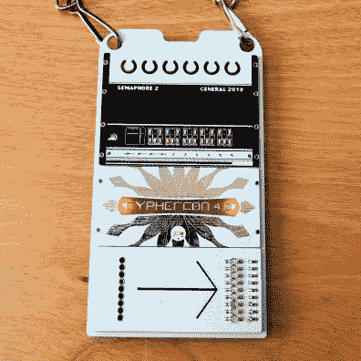](https://hackaday.com/2019/04/12/cyphercon-badge-has-a-paper-tape-reader-built-in/cyphercon-badge-square-front/)  [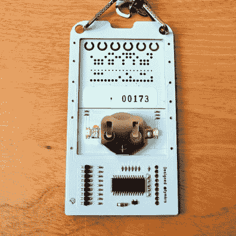](https://hackaday.com/2019/04/12/cyphercon-badge-has-a-paper-tape-reader-built-in/cyphercon-badge-square-back/) 

这是由 [@tymkrs](https://twitter.com/tymkrs) 设计的，这个团队设计了[去年的 DEF CON 26 徽章](https://hackaday.com/2018/08/09/first-look-at-def-con-26-official-badge/)和之前的 Cyphercon 徽章。这个是由三个不同的垂直放置的面板组成的。顶部是旗语面板(如此命名是因为它印在丝网上)，其中包括 25 个 led 阵列，每组 5 个。就在那上面，你会看到马蹄形的洞。这些是消耗品，是当你参观纸带穿孔机时用角刀剪下的基底部分——它限制了你可以获得这些胶带来黑你的徽章的次数。下一个面板是前面带有“Cyphercon 4.0”的面板，后面是硬币电池。最后一个面板是磁带阅读器和逻辑电路。

 [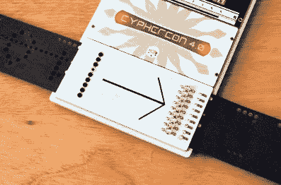](https://hackaday.com/2019/04/12/cyphercon-badge-has-a-paper-tape-reader-built-in/closeup-tape-reader-top/) Paper tape feeding through the badge [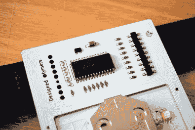](https://hackaday.com/2019/04/12/cyphercon-badge-has-a-paper-tape-reader-built-in/cyphercon-badge-circuit-details/) Logic circuit includes IR sensors for reading the tape

沿着磁带阅读器的右边缘，您可以看到组成磁带阅读器本身的红外发射器和传感器阵列。沿着左边缘有一系列的孔，作为一个指南，所以你可以穿你自己的磁带。在徽章的背面，您可以找到 PIC16F15355。

[磁带通过](https://twitter.com/szczys/status/1116421332508520448)进给，中间的一个孔(比其余的小)作为时钟信号。其他八个孔传送数据。

[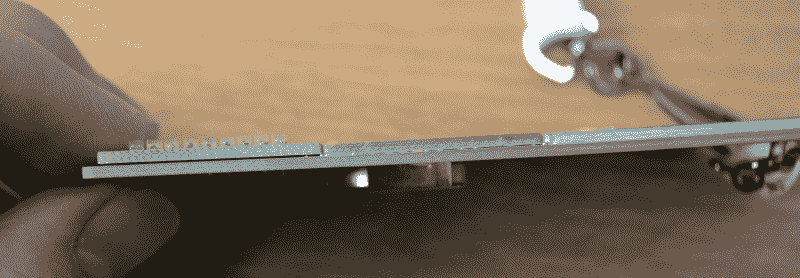](https://hackaday.com/wp-content/uploads/2019/04/cyphercon-badge-edge-assembly-detail.jpg)

这个徽章的组装技术令人难以置信。如果你沿着边缘看，你可以看到三个面板是如何放置在载板上的。在制造过程中，一些金属原料被用作间隔物，以便在面板回流后为纸带留出空间——面板下侧有焊盘，与载板上的足迹相匹配。

[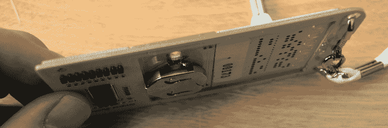](https://hackaday.com/wp-content/uploads/2019/04/cyphercon-badge-back-assembly-detail.jpg)

如果你使用合同制造商，我将非常昂贵地制造这个。幸运的是，玩具制造商是他们自己的 CM，所以他们只是通过增加自己的劳动力来挥霍定制流程。看到模块化设计和致力于实现这一点，真的令人印象深刻。我喜欢载板的深度有助于减少 CR2450 硬币电池的电池座伸出的距离。

 [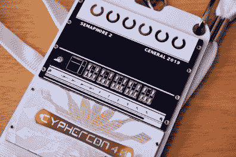](https://hackaday.com/2019/04/12/cyphercon-badge-has-a-paper-tape-reader-built-in/cyphercon-badge-semiphore-plate/)  [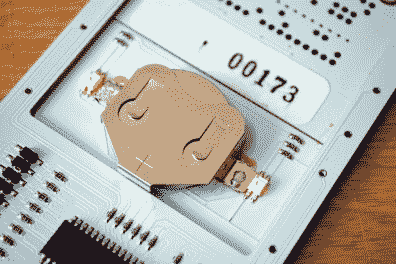](https://hackaday.com/2019/04/12/cyphercon-badge-has-a-paper-tape-reader-built-in/cyphercon-badge-psu-plate/) 

这是面板的详细视图。电池面板上的后置 led 为红色/绿色，信号灯面板上的 led 仅为红色。

 [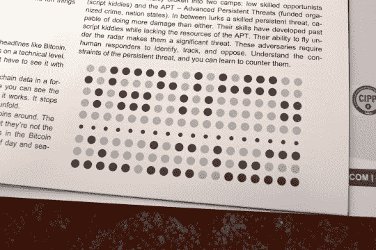](https://hackaday.com/2019/04/12/cyphercon-badge-has-a-paper-tape-reader-built-in/cyphercon-tape-pattern-in-program-book/) Tape pattern found in the conference program [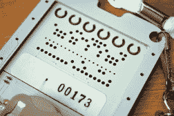](https://hackaday.com/2019/04/12/cyphercon-badge-has-a-paper-tape-reader-built-in/cyphercon-badge-semiphore-plate-back/) Tape pattern found on the back of the badge [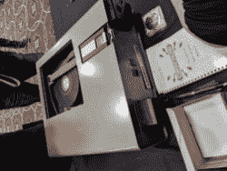](https://hackaday.com/2019/04/12/cyphercon-badge-has-a-paper-tape-reader-built-in/img_20190411_141020/) Machine used to punch the tape [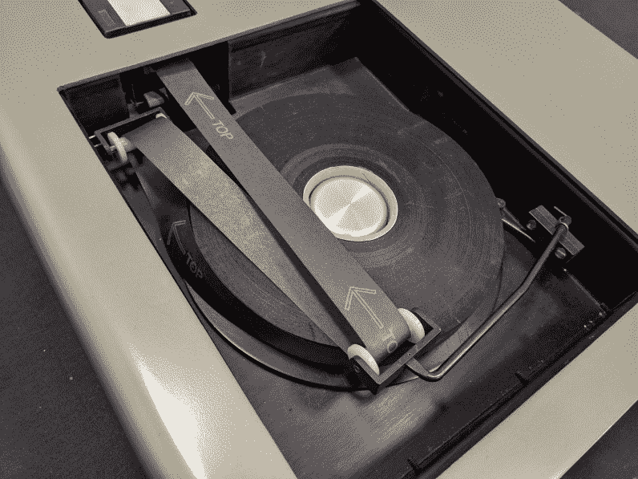](https://hackaday.com/2019/04/12/cyphercon-badge-has-a-paper-tape-reader-built-in/img_20190411_140934/) These rolls of paper tape are fairly rare now

这个会议叫做 Cyphercon，所以有一个难题需要解决也就不足为奇了。您可以在徽章背面和会议指南手册中找到胶带图案。演讲者和组织者的徽章是不同的，我认为你需要收集所有的模式，并将它们组合起来，以解开隐藏在里面的东西。

[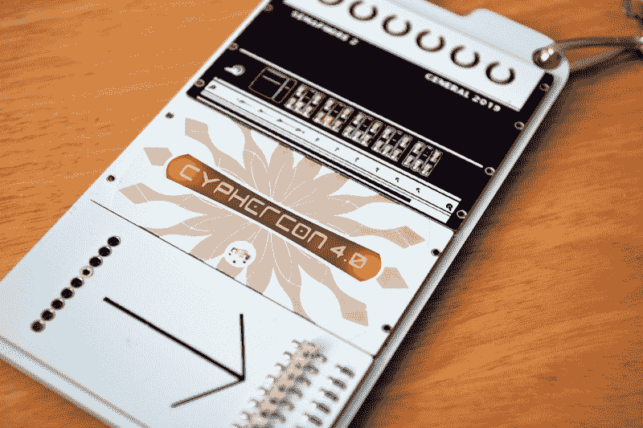](https://hackaday.com/wp-content/uploads/2019/04/cyphercon-artsy-closeup.jpg)

这是一个美丽的徽章，即使你不是试图解决徽章的难题。但是互动是如此诱人。到目前为止，我已经看到一个团队[带来了一台激光打印机和透明胶片来制作他们自己的胶带](https://twitter.com/szczys/status/1116421800064364545)，在胶带上留下“孔”不被打印。另一个人提到试图用另一个微控制器直接连接到红外传感器，通过它电子欺骗馈送带。这是一个简单的机制，也是每个试图在这次会议上解开谜题的人的成功之作。

这里有一个关于玩具制造商制作的徽章的视频来解释涉及这个徽章的活动。

 [https://www.youtube.com/embed/0hTXV7WTQjE?version=3&rel=1&showsearch=0&showinfo=1&iv_load_policy=1&fs=1&hl=en-US&autohide=2&wmode=transparent](https://www.youtube.com/embed/0hTXV7WTQjE?version=3&rel=1&showsearch=0&showinfo=1&iv_load_policy=1&fs=1&hl=en-US&autohide=2&wmode=transparent)

