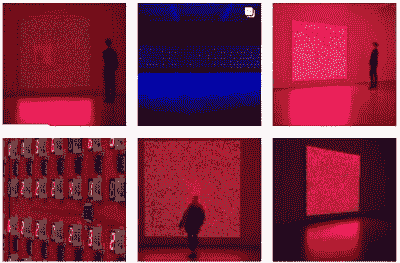

# 菊花链七段艺术展示

> 原文：<https://hackaday.com/2019/10/23/daisy-chained-seven-segment-art-display/>

这款[七段艺术显示器](https://hackaday.io/project/163549-a-seven-segment-art-installation)采用了 81 个七段红色共阴极 LED 显示屏。led 排列在 100x100mm 毫米的电路板上，每个电路板包含一个 Arduino Nano 和 9 个七段显示器，通过电路板侧面的三引脚接头以菊花链形式连接。引脚(电源、接地和串行)提供在每个连接的电路板上传播程序所需的信号。

第一块电路板(带有两个 Arduino Nanos)发送指令，指示点亮哪些数字，并驱动显示器，将指令发送到链上的下一块电路板。

在多路复用安排中，单个 Arduino Nano 能够驱动多达 12 个七段显示器，但该程序只需要驱动 9 个，从而保持 D13 的内置 LED 和串行引脚空闲。由于板上没有电阻，限流是通过软件实现的。这是受 Sinclair 科学计算器上的气泡 LED 显示屏的启发，这样做是为了通过占空比控制电流来实现更大的亮度。

数字点亮的时间间隔是 2 毫秒，给它们一些时间冷却。演示中的动画展示了下降和递增的数字，以及使用线性反馈移位寄存器的随机数发生器。

 [https://www.youtube.com/embed/N3Iv4kHhSOE?version=3&rel=1&showsearch=0&showinfo=1&iv_load_policy=1&fs=1&hl=en-US&autohide=2&wmode=transparent](https://www.youtube.com/embed/N3Iv4kHhSOE?version=3&rel=1&showsearch=0&showinfo=1&iv_load_policy=1&fs=1&hl=en-US&autohide=2&wmode=transparent)

The [HackadayPrize2019](https://prize.supplyframe.com) is Sponsored by:     