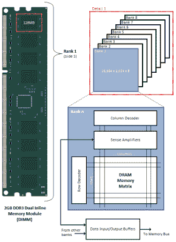
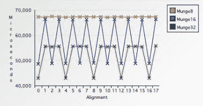

# 跨架构的数据对齐:好的、坏的和难看的

> 原文：<https://hackaday.com/2022/05/10/data-alignment-across-architectures-the-good-the-bad-and-the-ugly/>

尽管计算机的内存映射乍看起来非常平滑，而且是字节可寻址的，但同样的内存在硬件层面上就要颠簸得多。开发人员在这种情况下可能会遇到的一个基本术语是*数据对齐*，它指的是硬件如何访问系统的随机存取存储器(RAM)。这和其他的是系统的 RAM 和存储器总线实现的属性，对于软件开发者具有各种含义。

对于 32 位内存总线，某些数据的最佳访问类型是 4 字节，在内存中 4 字节边界上精确对齐。当试图进行未对齐的访问时会发生什么——例如将上述四个字节的值对齐到一个字中——是由实现定义的。一些硬件平台有对非对齐访问的硬件支持，其他平台抛出一个操作系统(OS)可以捕捉的异常，并退回到软件中的非对齐例程。如果您尝试非对齐访问，其他平台通常会抛出总线错误(POSIX 中的 SIGBUS)。

然而，即使允许非对齐内存访问，真正的性能影响是什么？

## 硬件视图

[](https://hackaday.com/wp-content/uploads/2022/04/DRAM-Memory-Topology.png)

Basic DRAM topology (Credit: Anandtech)

尽管系统内存看起来模糊不清，但它以同步动态随机存取存储器( [SDRAM](https://en.wikipedia.org/wiki/Synchronous_dynamic_random-access_memory) )的形式实现时，会受到物理限制。Rajinder Gill 在 2010 年 Anandtech [的一篇文章中找到了关于 SDRAM 如何工作的很好的入门。从这一点可以看出，SDRAM 模块是如何寻址的。](https://www.anandtech.com/show/3851/everything-you-always-wanted-to-know-about-sdram-memory-but-were-afraid-to-ask)

每个读写请求必须选择 DIMM (BAn)上的目标存储体，然后是指定目标行(RAS)和列(CAS)的命令。每行由数千个单元组成，DIMM 上的每个 SDRAM 芯片向 DDR 3 和 DDR 4 DIMMs 上的 64 位数据总线提供 8 位数据。

这种物理配置的结果是，对 RAM 和中间缓存的所有访问都沿着这些物理定义的边界对齐。当内存控制器的任务是检索某个变量的数据时，如果可以在一次读操作中从 RAM 中取出该数据，以便将其读入 CPU 的寄存器中，这将非常有用。

当这些数据没有对齐时会发生什么？可以先读取数据的初始部分，然后执行第二次读取以获得最终部分，然后合并这两部分。当然，这是一个必须由内存控制器直接支持或者由操作系统处理的操作。

当被要求访问无效地址、遇到分页错误或被要求执行不支持的非对齐访问时，内存控制器将生成[总线错误](https://en.wikipedia.org/wiki/Bus_error)。x86 及其衍生产品等平台支持非对齐内存访问。

## 当事物爆炸时

如前所述，x86 和 x86_64 本质上是可以接受的，但是您可以使用您选择的或随机使用的对齐方式来访问系统 RAM。事情变得更加混乱的是其他平台，例如 ARM，ARMv7 文档列出了非对齐数据访问环境中的平台属性。本质上，在相当多的情况下，你会得到一个硬件对齐错误。

在 2005 年的这篇 IBM 文章中，介绍了那个时代的摩托罗拉 m68k、MIPS 和 PowerPC CPUs 是如何处理非对齐访问的。这里要注意的有趣的事情是，直到 68020，未对齐的访问总是会抛出总线错误。MIPS CPUs 不以速度的名义为非对齐访问而烦恼，PowerPC 采用了一种混合方法，允许 32 位非对齐访问，但 64 位(浮点)非对齐访问会导致总线错误。

当涉及到复制 SIGBUS 对齐错误时，这可以使用例如指针的解引用来容易地完成:

```

uint8_t* data = binary_blob;
uint32_t val = *((uint32_t*) data);

```

这里`binary_blob`被假设为可变大小值的集合，而不仅仅是 32 位整数。

虽然这段代码可以在任何 x86 平台上很好地运行，但在基于 ARM 的平台上，如 Raspberry Pi，以这种方式取消引用肯定会导致 SIGBUS 错误和一个非常死的进程。问题在于，当你请求以 32 位整数的形式访问`uint8_t`指针时，它成为正确对齐的`uint32_t`的可能性基本为零。

那么在这种情况下应该怎么做呢？

## 保持一致

使用对齐内存访问的理由很多。其中最重要的是原子性和可移植性。原子性是指可以在单个读取或写入操作中执行的整数读取或写入。在非对齐访问的情况下，这种原子性不再适用，因为它必须跨边界读取。一些代码可能依赖于这种原子读写，当不考虑非对齐访问时，可能会导致有趣的零星错误和崩溃。

然而，最明显的问题是便携性。正如我们在上一节中看到的，很容易编写出在一个平台上运行良好的代码，但在另一个平台上会死得很惨。然而，有一种方法可以编写完全可移植的代码，这实际上在 C 规范中被定义为一种复制数据而不会遇到对齐问题的真正方法: [memcpy](https://www.cplusplus.com/reference/cstring/memcpy/) 。

如果我们使用`memcpy`重写前面的代码片段，我们会得到下面的代码:

```

#include &lt;cstring&gt;
uint8_t* data = binary_blob; 
uint32_t val;
memcpy(&val, data, 4); 

```

这段代码是完全可移植的，任何对齐问题都由`memcpy`实现来处理。例如，如果我们在 Raspberry Pi 系统上执行这样的代码，将不会产生 SIGBUS 错误，并且该进程将继续运行以看到另一个 CPU 周期。

[数据结构，C 中的](https://en.wikipedia.org/wiki/Data_structure_alignment#Data_structure_padding) `struct`，是相关数据值的分组。因为这些是以连续的方式放在 RAM 中的，这显然会产生对齐问题，除非应用填充。默认情况下，编译器会在必要的地方添加此类填充，以确保结构的每个数据成员在内存中对齐。显然，这“浪费”了一些内存并增加了结构的大小，但确保了数据成员的每次访问都是完全对齐的。

对于使用结构的常见情况，如 MCU 和外围硬件设备上的内存映射 I/O，这通常不是问题，因为这些仅使用 32 位或 64 位寄存器，当第一个数据成员为时，这些寄存器总是对齐的。由于性能和大小的原因，手动调整结构填充对于编译器工具链来说通常是可能的，但是应该非常小心。

## 性能影响

但是，有人可能会问，忽略数据对齐并让硬件或操作系统掩盖复杂性会对性能产生什么影响？正如我们在探索系统 RAM 的物理实现时所看到的，不对齐访问是可能的，代价是额外的读或写周期。显然，这将使这种循环的数量至少增加一倍。如果这种情况发生在所有银行，对业绩的影响可能会很大。

[](https://hackaday.com/wp-content/uploads/2022/04/quadChart.jpg)

Single- versus double- versus quad-byte access (Credit: Jonathan Rentzsch, IBM)

在早先引用的由张克帆·伦茨奇撰写的 2005 年 IBM 文章中，提供了许多使用单字节、双字节、四字节和八字节访问模式的基准测试结果。尽管运行在相当缓慢的 800 MHz PowerBook G5 上，但非对齐访问的影响非常明显，两字节非对齐访问比对齐访问慢 27%。对于四字节非对齐访问，这比对齐的两字节访问要慢，这使得切换到更大的数据大小变得无关紧要。

当切换到 8 字节对齐访问时，这比对齐的 4 字节访问快 10%。然而，由于 PowerPC G4 没有对 8 字节非对齐访问的硬件支持，而是由操作系统执行必要的合并操作，因此整个缓冲区的非对齐 8 字节访问花费了惊人的 1.8 秒，比对齐慢 4.6 倍。

性能影响不仅涉及标准 CPU ALU 操作，还涉及 SIMD(向量)扩展，如 [Mesa et al. (2007)](https://www.researchgate.net/publication/232635910_Performance_Impact_of_Unaligned_Memory_Operations_in_SIMD_Extensions_for_Video_Codec_Applications) 所详述。此外，在 x264 编解码器的开发过程中，发现在 x264 中最常用的功能之一上，使用[缓存线对齐](http://web.archive.org/web/20120417184641/http://x264dev.multimedia.cx/archives/96)(对齐的 16 字节传输)要快 69%。这里的含义是，数据对齐远远超出了系统 RAM，还适用于高速缓存和计算机系统的其他元素。

这在很大程度上归因于(常见)操作的加倍以及由此带来的对整体性能的影响。

## 总结

在某些方面，x86 体系结构在保护您免受现实中的丑陋部分(如非对齐内存访问)方面相当舒适，但现实有办法在您最不期望的时候悄悄靠近您。几个月前，我在对一个远程过程调用库进行一些分析和优化时，就遇到了这样一个情况。

在 Valgrind [中的 Cachegrind 剖析工具向我展示了](https://mayaposch.wordpress.com/2021/11/11/refactoring-nymphrpc-for-zero-copy-optimisation/)内部正在进行的大量未对齐复制之后，面临的挑战是不仅要实现零复制版本的库，还要就地解析二进制数据。这导致了在解引用(打包的)二进制数据时不对齐的存储器访问的一些前述含义。

虽然使用前面提到的基于`memcpy`的解决方案很容易解决这个问题，但它让我对基于 ARM 的系统上的 SIGBUS 错误有了一个有趣的了解，在基于 ARM 的系统上，相同的代码可以在 x86_64 系统上顺利运行。至于性能影响？RPC 库修改前后的基准测试显示，性能有了显著的提高，这在一定程度上可能是由于切换到了对齐访问。

尽管周围有人坚持认为非对齐访问对性能的影响目前还不足以令人担忧，但对可移植性和原子性的真正影响应该让任何人都停下来。除此之外，通过一个分析器来运行代码以了解内存访问模式是什么样的，以及哪些可以改进或优化，这是完全值得的。