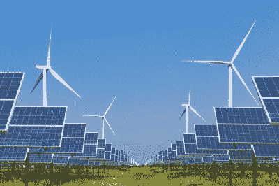
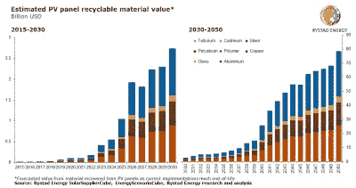

# 废弃的太阳能电池板是最热门的新型可回收材料

> 原文：<https://hackaday.com/2022/07/19/dead-solar-panels-are-the-hottest-new-recyclables/>

说到可再生能源，有许多很好的来源。不管是太阳能、风能还是其他什么，我们都需要大量的能源。全球各地的工厂正在迎接挑战，提供我们需要的东西。

当然，我们可以建造大量新的太阳能电池板，但我们需要考虑当它们到达寿命终点时会发生什么。事实证明，随着如此多的太阳能投入使用，一个新的大型回收产业可能就在眼前。

## 碾碎它们

Wind turbines and solar panels are being installed en-masse to supply renewable energy to the grid. Neither last forever, and planning for their end-of-life is key to avoiding valuable materials ending up in landfill. Credit: Adobe Stock

太阳能电池板在从太阳获取能量方面很棒，但它们不会永远存在。它们可能会损坏或粉碎，或者只是老化。大多数面板的额定使用寿命为 25 年。太阳能热在 2000 年代初真正起飞，从那以后势头越来越猛。这意味着我们将很快面临大量准备退役的太阳能电池板。

像许多现代技术一样，太阳能电池板将一堆昂贵而奇特的材料包装成一个奇特的产品。太阳能光伏电池由银、铜和铝等贵重材料制成。这种电池还使用大量的多晶硅，生产成本很高。其他微量材料可能包括焊料连接中使用的锡和铅，尽管近年来危险废物法规已经减少了这种物质。

问题是，所有这些花哨的材料可能很难分离出来。面板背面的铜线可以相对容易地切断，铝框架也可以剥离。然而，所有其他材料需要更多的加工。

目前，大部分回收的太阳能电池板基本上被粉碎，并作为相对不纯的碎玻璃处理，在工业中称为碎玻璃。结合铜线和铝框架，回收者可以指望通过他们的努力获得大约 3 美元一个面板。这与加工成本相比并不划算，当运输和加工成本累积起来时，每块面板的成本可能在 12 美元到 25 美元之间。

这些高昂的成本意味着许多太阳能电池板只是被送去填埋。目前，在美国只有大约 10%的太阳能电池板被回收。

## 新工艺是关键

从太阳能电池中回收更多的诀窍是在回收过程中更加小心。[一种称为 FRELP 工艺](https://www.sciencedirect.com/science/article/pii/S0927024816001227?via%3Dihub)的方法，用于“完全回收寿命终止光伏”工艺。它使用一把热刀小心地将硅电池从面板的玻璃和塑料中分离出来，这样每个组件都可以单独处理。然后，化学过程可以用来分离出高价值的银和铜，而不是让这些材料与玻璃搅在一起。人们希望回收的硅纯度足够高，可以重新用于太阳能电池板的生产，而不需要昂贵的再提纯步骤。

 [https://www.youtube.com/embed/PaUlSZ2biI8?version=3&rel=1&showsearch=0&showinfo=1&iv_load_policy=1&fs=1&hl=en-US&autohide=2&wmode=transparent](https://www.youtube.com/embed/PaUlSZ2biI8?version=3&rel=1&showsearch=0&showinfo=1&iv_load_policy=1&fs=1&hl=en-US&autohide=2&wmode=transparent)

废物管理公司威立雅(Veolia)也在这一领域开展工作，[自 2018 年](https://www.veolia.com/en/solution/recycling-photovoltaic-panels-technology-unique-france)起在法国运营一家商业规模的工厂，[今年在德国开展了一个更新的测试项目](https://eitrawmaterials.eu/european-project-reprosolar-led-by-veolia-germany-will-test-full-photovoltaic-recycling-on-an-industrial-scale/)。与大多数工序类似，布线、电缆面板和铝框架都被移除，在这种情况下是由机器人移除。然后，光伏板本身被切成小片，磨碎，用涡流分离器将玻璃与金属成分分离。这可以有效地回收原材料，而不是简单地粉碎整个面板，并将所有贵金属和硅与玻璃混合。威立雅希望继续开发其工艺，以便能够可靠地从电池板中回收高纯度的银和硅，并在新电池板的生产中重新使用。该公司希望加快运营，使其能够回收法国所有废弃的太阳能电池板。

## 一个即将繁荣的行业

Rystad Energy estimates that the solar panel recycling market will boom as installed panels start aging out in coming years. Source: Rystad Energy

全球太阳能电池板废料流将会激增。截至 2016 年底，约有 25 万吨废电池板，但预计到 2050 年将激增至 500 万吨。随着越来越多的太阳能装机容量被安装，它为未来锁定了更大的废物流。

这个巨大的废物流正迅速成为一种可供开发的资源。各公司将竞相从充满贵金属的废物流中分得一杯羹，而不是经营银矿或铝矿。关键在于完善技术，以一种清洁且低成本的方式提取和提纯这种金属。研究公司 Rystad 预计，到 2030 年，太阳能回收行业的价值将达到 27 亿美元，到 2050 年将达到 800 亿美元，而今天这个数字只有区区 1 . 7 亿美元。

掌握太阳能电池板和风力涡轮机的回收将是确保我们拥有未来所需的可再生能源的关键。因此，如果你对如何从太阳能电池板中回收材料有一些创造性的想法，在未来几年里有很多赚钱的机会！

横幅照片:“T0”安装太阳能电池板由俄勒冈州交通部。

(是的，我们知道，但是“安装的顺序与拆卸的顺序相反。”)