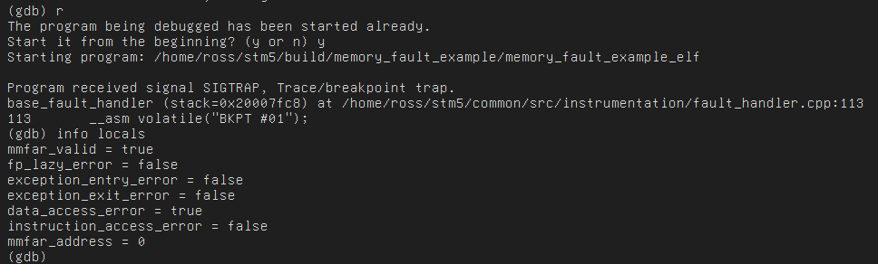

# 调试超能力让 STM32 起死回生

> 原文：<https://hackaday.com/2019/08/26/debug-superpowers-bring-an-stm32-back-from-the-dead/>

当一个处理器出现故障时，它可能会在因果关系中留下一点看似珍贵的东西。在简单的情况下，通过打印语句进行调试令人惊讶地工作得很好，但是在桌面环境中，如果您要使用调试器来解决更棘手的问题，这在嵌入式系统上可能是一项繁重的任务。[【Ross Schlaikjer】的精彩博文](https://rhye.org/post/stm32-with-opencm3-5-fault-handlers/)讲述了如何设置一个我们最喜欢的开放式硬件调试探针，并向我们展示了使用正确的工具，意料之外的故障并不那么难以克服。

事实证明，当一个 CPU 出现故障时，它并不会破坏所有的状态。事实上，错误处理程序*只是另一段代码*！打印可能不安全，但通过调试器，您可以提取工作寄存器来确定错误的原因和其他状态，如最后一条指令是什么，CPU 在它发生之前正在运行！这可以通过手工调试工作来完成，或者你可以按照类似[Ross]的说明，设置一些聪明的代码来自动提取相关的值。他提供了一个易于理解的解释，说明什么寄存器是有趣的，以及如何将结构放在一起以从中提取值。在 Hackaday，我们是简单的人，所以除了指示故障类型的位掩码之外，我们最喜欢的是链接寄存器，它保存要返回的地址(也就是导致故障的地址！).还有一些其他巧妙的技巧，比如使用汇编指令“BKPT #01”来强制调试器断点。

如果这引起了你的兴趣，并且你想要更多关于嵌入式开发的对话，我们花了一些时间在 [Hackaday 播客第 31 集](https://hackaday.com/2019/08/16/hackaday-podcast-031-holonomic-drives-badges-of-def-con-we-dont-do-on-chip-debugging-and-small-run-manufacturing-snafus)上讨论了它和其他主题。