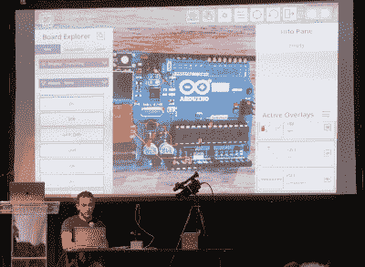

# 用增强现实调试 PCB

> 原文：<https://hackaday.com/2020/02/05/debugging-pcbs-with-augmented-reality/>

Mihir Shah 一生中设计了许多 PCB。然而，在开发过程中，他厌倦了与团队交流设计数据的混乱、陈旧的方法。注释照片既慢又麻烦，而发送电路板设计文件需要每个人都使用相同的软件并跟上速度。Mihir 认为他有一个更好的解决方案，名为 InspectAR，这是一个增强现实平台，可以让你看到电路板的内部，以及他在 2019 年 Hackaday 超级大会上演示的[。](https://www.youtube.com/watch?v=uJ7MdUl63FU)

The InspectAR package makes it easy to visualise signals on the board.

InspectAR 的想法是使用增强现实来帮助工作和调试电子设备。这是一套功能强大的工具，能够在电路板的视频馈送上实时叠加图形，使用户能够快速有效地跟踪信号、识别元件并了解情况。它可以与智能手机或网络摄像头配合使用，目的是通过为每个人提供一个工具来改善工程师之间的协作和交流，这个工具可以轻松地向他们展示正在发生的事情，而不需要每个人都运行一个成熟而昂贵的电子设计包。

Supercon talk 用来演示带有 Arduino Uno 的 InspectAR 的一些功能。只需点击几下，Mihir 就可以在他的手指间旋转，不同的引脚和信号就可以在板上高亮显示。以地面为例，Mihir 首先突出了整个信号。这看起来有点乱，大的地平面很难看清到底发生了什么。以示波器探头需要一个连接点为例，[Mihir]转而切换到仅焊盘模式，清楚地显示出用户可以在 PCB 裸焊盘上找到信号的位置。这种对细节的关注显示了 InspectAR 开发背后强大的可用性精神，我们已经可以想象在使用不熟悉的电路板时它的价值。还可以突出显示不同的组件并显示元数据——这将使查找组装错误变得轻而易举。必要时，它还可用于快速调出相关芯片的数据手册。

 [https://www.youtube.com/embed/uJ7MdUl63FU?version=3&rel=1&showsearch=0&showinfo=1&iv_load_policy=1&fs=1&hl=en-US&autohide=2&wmode=transparent](https://www.youtube.com/embed/uJ7MdUl63FU?version=3&rel=1&showsearch=0&showinfo=1&iv_load_policy=1&fs=1&hl=en-US&autohide=2&wmode=transparent)

显然，电子设计领域是一个碎片化的领域，市场上有大量相互竞争的软件。无论你是老鹰的死忠，Altium 的狂热爱好者，还是 KiCad 的粉丝，都可以使用 InspectAR。米希尔和他的团队目前正在欧特克公司的办公场所办公，欧特克公司看到了这个项目的价值，并支持其早期步骤。该软件可供用户免费试用，有几种流行的电路板可供测试。作为 Supercon 的一个聚会项目，如果你想尝试一下，我们可以提供自己的 Hackaday 徽章，以及几个 Arduino 板。我们迫不及待地想知道接下来会发生什么，并完全期待在新一轮的电路板开发中，我们自己最终会使用 InspectAR！