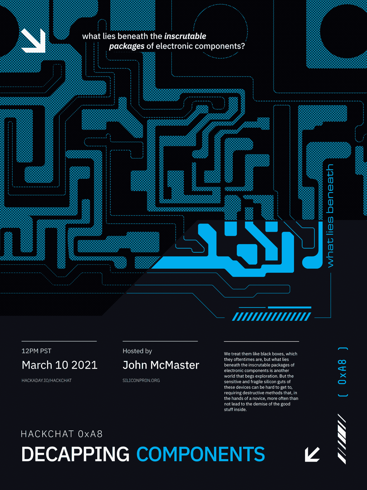

# 解封组件黑客与约翰麦克马斯特聊天

> 原文：<https://hackaday.com/2021/03/08/decapping-components-hack-chat-with-john-mcmaster/>

加入我们太平洋时间 3 月 10 日星期三中午与[约翰·麦克马斯特](https://hackaday.io/hacker/1171816-johndmcmaster)的[解封组件黑客聊天](https://hackaday.io/event/177772-decapping-components-hack-chat)！

我们像对待黑匣子一样对待它们，它们经常是黑匣子，但是隐藏在难以理解的电子元件包装之下的是另一个需要探索的世界。但这些设备敏感而脆弱的硅内脏可能很难触及，需要破坏性的方法，在新手手中，往往会导致内部好东西的消亡。

为了帮助我们梳理获得内部组件的过程，约翰·麦克马斯特将在黑客聊天室停下来。你可能会从 Twitter 和 YouTube 上认出约翰的作品，或者从他的[SiliconPr0n.org](https://siliconpr0n.org/)网站上认出他，那里有他开封的一些薯片的美照。约翰也是逆向工程社区的大人物，他组织了[山景城逆向工程聚会](https://www.meetup.com/Mountain-View-Reverse-Engineering-Meetup/)，这是一个定期聚会讨论组件秘密世界的团体。请加入我们，和约翰一起谈论一些观察这个世界的方法和材料。

 我们的黑客聊天是 [Hackaday.io 黑客聊天群发消息](https://hackaday.io/messages/room/2369)中的社区直播活动。本周，我们将于太平洋时间 3 月 10 日星期三中午 12:00 坐下来讨论。如果时区束缚了你，我们有一个[方便的时区转换器](https://www.timeanddate.com/countdown/generic?iso=20210310T12&p0=224&msg=Decapping+Components+Hack+Chat&font=cursive)。

点击右边的那个发言气泡，你会被直接带到 Hackaday.io 上的黑客聊天群，不用等到周三；随时加入，你可以看到社区在谈论什么。

