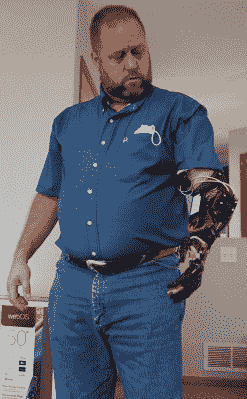

# 深度学习实现直观的假肢控制

> 原文：<https://hackaday.com/2021/05/27/deep-learning-enables-intuitive-prosthetic-control/>

假肢从简单的静止的人体部分复制品发展到可移动的活动装置的过程一直很缓慢。这主要是因为控制假肢的许多关节不是一件容易的事情。然而，研究人员已经努力简化这项任务，通过捕捉神经信号，并允许深度学习例程来解决其余问题。

The prosthetic arm under test actually carries a NVIDIA Jetson Nano onboard to run the AI nerve signal decoder algorithm.

[在一篇预先发表的论文中，](https://arxiv.org/abs/2103.13452)研究人员使用植入电极来捕捉 Shawn Findley 前臂正中神经和尺神经的信号，Shawn find ley 在 17 年前的一次机械车间事故中失去了一只手。然后，一个人工智能解码器被训练使用 NVIDIA Titan X GPU 来破译来自电极的信号。

完成后，解码器模型可以在一个明显更轻量级的系统上运行，该系统由 NVIDIA Jetson Nano 组成，小到足以安装在假肢上。这使得芬德利可以通过思想控制假手，而不需要连接任何外部设备。该系统还允许直观控制 *Far Cry 5，*这听起来也很有趣。

这项研究令人兴奋，这是全功能假肢成为现实的又一步。该技术的关键在于，模型可以在功能强大的硬件上训练，但可以在低端得多的单板计算机上运行，从而避免假肢用户携带笨重的硬件来使神经接口工作。[如果它能与非侵入性神经接口](https://hackaday.com/2016/12/31/move-a-robotic-hand-with-your-nerve-impulses/)相结合，预计这项技术将在世界各地的使用中爆发。

【感谢布莱恩·考尔菲尔德的提示！]