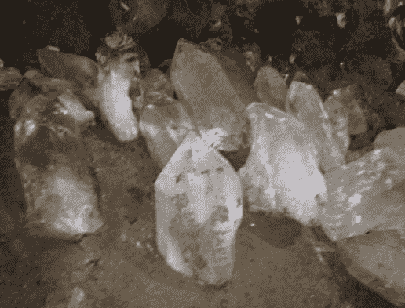
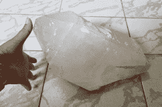
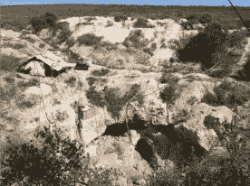
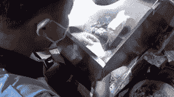
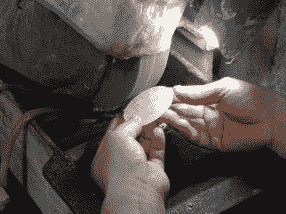
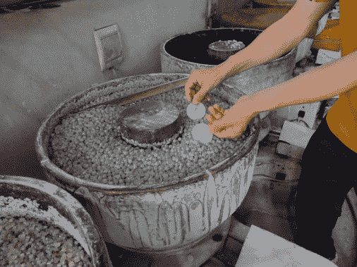
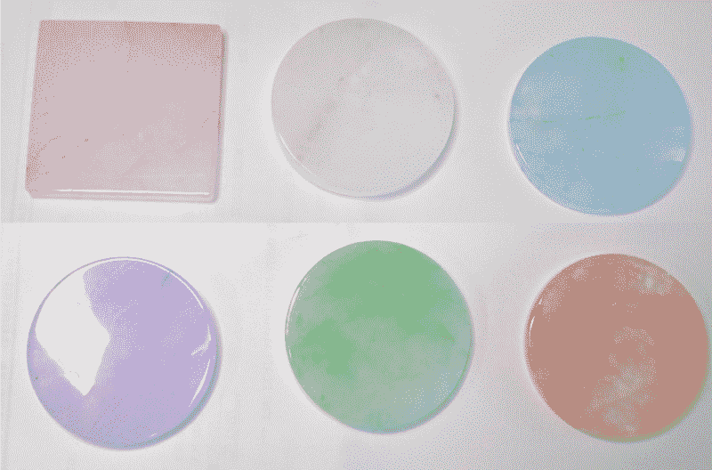

# DEF CON 27:徽章对话；或者有一次乔·格兰德采购了 30000 颗宝石

> 原文：<https://hackaday.com/2019/08/09/def-con-27-the-badge-talk-or-that-one-time-joe-grand-sourced-30000-gemstones/>

昨天我们发布了在 DEF CON 27 徽章上发现的硬件的第一张图片。运动磁耦合无线通信方案，而不是基于射频的一个，和一个有趣的方式连接挂绳都引起了我的注意。但是宝石面板和 LED 扩散器有自己令人难以置信的背景故事，你不想错过。

今天早上，Joe Grand——今年以及 DC18 之前硬件徽章辉煌岁月的徽章制造商——上台分享了他的故事，讲述了他对 28，500 个徽章的制造过程进行概念化、原型化和管理的故事。想象一下按时、按预算交付一个令人愉快的概念的压力…嗯，几乎是按预算。在谈话中，他无意中泄露了挂在每块印刷电路板正面的石英晶体。 

## 让我们来谈谈宝石

等等，在你点击离开之前，请相信我，这块宝石至少和这个徽章上的电子元件一样有趣。当然，你可以现在就去订购一个微控制器、发光二极管和电路板上显示的所有其他元件。但你将有一个明显更难找到的石英盘，使这个徽章的中心和 LED 扩散器的分量。

乔开了很多关于住在波特兰的玩笑，那里“每个角落都有一家新时代的水晶店”。但是，当他向当地的供应商提出为徽章项目采购 3 万颗宝石时，他们笑了。但他们确实让他想到了去图森宝石展，那是他真正开始兔子洞之旅的地方。珠宝交易会上满是批发商，他们自己也不能提供他实际需要的数量，但他们确实给他介绍了准备接受定制订单的工厂。

  Quartz before being harvested  One raw crystal  Quartz mining in Brazil

这种石英是在巴西的一个矿场从地下开采出来的，是大约一个可笑的橄榄球大小的原始晶体。它们被运到中国的一家工厂，在那里进行劳动密集型的加工，将它们变成光滑的杯垫。

  Cutting each slice into a rough circle on a wet saw  Easing the edges  Trip through a media polisher

在用手描画圆形之前，将粗石英切成大约 5 毫米的成品厚度。然后在湿锯上切割成线条，在砂轮上手工加工成最终形状。经过振动介质抛光机的一次打磨，表面呈现出透明的玻璃般的光洁度。

乔认为这将是一个非常不同的过程，可能从一个核心样本类型的钻井过程开始。但石头本身的性质似乎需要人眼来判断在每一片上哪里切割，哪里放置石头的最终形状。一般的入场证——被称为“人”——按原样使用。所有的“人”徽章(发言人、记者、保安人员)都染成了与徽章类型相匹配的颜色。

这些宝石真的很特别，即使今年 DEF CON 的近 30，000 名观众中的大多数人可能会失去对它们的努力。我很高兴 Joe Grand 花时间在他的演讲中阐述了这个高度参与的小细节的背景故事，这实际上使每一个徽章都独一无二。您可以在 DEF CON 媒体服务器上找到他演讲中的[幻灯片以及徽章硬件信息。](https://media.defcon.org/DEF%20CON%2027/DEF%20CON%2027%20badge/)