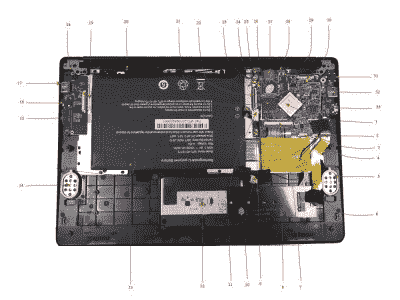

# 自由度:引导 ARM 处理器

> 原文：<https://hackaday.com/2020/08/12/degrees-of-freedom-booting-arm-processors/>

任何采用 x86 处理器的现代计算机，无论是英特尔还是 AMD，都是软件自由和隐私的输家。我们对此喋喋不休，但值得重复的是，由于有了[英特尔管理引擎](https://hackaday.com/2017/12/11/what-you-need-to-know-about-the-intel-management-engine/) (IME)和 AMD 平台安全处理器(PSP)，几乎不可能获得在其上运行的免费开源固件。如果没有 libre 固件，即使你的操作系统是完全开源的，你也无法信任其他任何东西。

即使计算机关闭，IME 或 PSP 也可以访问内存、存储和网络堆栈，即使在计算机启动后，它们也在如此低的级别上运行，以至于操作系统无法意识到它们真正在做什么。幸运的是，在个人计算世界的竞赛中有一匹黑马，这给了我们一些希望，有一天会有一个 x86 的竞争对手，允许他们的用户拥有一个他们可以信任的免费固件。ARM 处理器多年来一直在稳步增加其用户份额，但自苹果公司最近发布声明以来，人们的兴趣激增，它将接管个人计算世界，并有望为那些关注自由和隐私的人提供一些相关的现代选择。但是在 ARM 处理器的现实世界中，前面的路肯定是漫长、曲折和分叉的。

即使忽略乏味的吹毛求疵，RISC 与 CISC 之间的区别现在比“过去”更加模糊，像 ARM 这样的 RISC 机器在英特尔和 AMD 制造的 x86 CISC 机器上有天然的优势。这些 [RISC 机器使用更少的指令](https://hackaday.com/2018/05/08/sophie-wilson-arm-and-how-making-things-simpler-made-them-faster-more-efficient/),并且比他们的 x86 竞争对手具有更高的热效率。它们通常可以被动冷却，避免需要主动冷却，不像许多 AMD/Intel 机器通常有嘈杂或笨重的风扇。但对我来说，最有趣的优势是能够在没有 x86 芯片专有固件的情况下运行 ARM 机器。

## ARM 是一种授权给许多制造商的架构

ARM 不像英特尔等 x86 厂商那样自己制造任何芯片。相反，他们维护自己的架构，并将其授权给其他公司，这些公司反过来构建使用 ARM 指令集的处理器。制造 ARM 处理器的公司几乎不计其数:Broadcom、高通、Rockchip、Atmel、STMicroelectronics 和 Texas Instruments 等等。不要忘了苹果，他们多年来一直在生产基于 ARM 的手机和平板电脑，并将把他们的整个产品线转移到这种卓越的架构上。

当涉及到固件和软件的隐私保护选项时，制造商的多样性既是福也是祸。由于有如此多的制造商，ARM 芯片几乎无处不在，而且如此普遍，以至于有大量关于如何为它们构建软件的知识(尽管桌面计算应用程序只是稍微落后一点)。

该平台的应用也是多种多样的，从微控制器到路由器，再到智能手机和一些个人电脑。然而，正如任何一个拥有 Android 手机的人在尝试解锁他们的引导程序时可能经历的那样，ARM 处理器没有统一的引导方式，基于 ARM 的芯片也没有统一甚至标准化的引导软件。一些使用 uboot 或 coreboot，一些需要使用一些二进制 blobs，还有一些使用非开源或不能以任何方式修改的专有固件，甚至禁止修改设备上的其他软件。

使用 ARM 设备的公司可以自由地开放他们的设备，尽可能地自由，就像 Pine64 对他们的手机、平板电脑和电脑所做的那样，但其他人(包括美国电话电报公司或威瑞森等手机服务提供商)可以利用 ARM 平台赋予他们的自由，确保他们的客户几乎无法访问在该硬件上运行的软件。如果原始制造商或供应商没有优先考虑，那么找到开放的 ARM 平台是一个挑战，但也有一些其他选择。

## 找到武装和自由固件的方法

其中一个更受欢迎的选项是 Rockchip RK3288，它使用 ARM Cortex-A17 处理器，可以在许多不同的 Chromebooks 中找到。Libreboot 是一个适用于少量计算机的免费开源固件，也适用于这些芯片，这意味着(只要你能安装正确的[图形驱动程序](https://panfrost.freedesktop.org/))你可以在这台计算机上运行 100%的免费软件。当然，芯片组已经有六年的历史了，所以虽然它比其他运行 libreboot 的电脑要新一点([就像在我的个人笔记本电脑上安装了 2008 年的](https://hackaday.com/2016/12/16/installing-libreboot/))但它仍然不是最现代的处理器。

[PineBook Pro teardown](https://wiki.pine64.org/index.php/Pinebook_Pro#Mainboard_Switches_and_Buttons) shows a Rockchip RK3399 ARM processor.

对于稍微新一点的东西，ARM 可能的开放性的一个很好的例子来自 Pine64，它生产了几台笔记本电脑、手机和一台平板电脑，都基于 ARM 芯片。例如，他们的 [PineBook Pro](https://www.pine64.org/pinebook-pro/) 使用升级的 Rockchip RK3399，它有两个 Cortex-A72 内核和四个 Cortex-A53 内核，这允许它在它们之间划分各种任务，以便充分利用这些芯片，当然它还使用 libre 引导程序。Rockchip 的产品也不是唯一的选择；自由软件基金会列出了其他具有不同软件自由度的[片上系统](https://www.fsf.org/resources/hw/single-board-computers)。

## ARM 上开放引导程序的流行选择

虽然 ARM 的开放性和多样性意味着任何地方的任何人都可以为他们选择的特定平台编写固件/引导加载程序/BIOS，但没有必要重新发明轮子。已经有一些选项是流行的选择。

其中最免费的是经常提到的 libreboot，它使用 100%免费的开源软件，从不使用任何二进制 blobs。它适用于 2010 年早期的一些基于 ARM 的笔记本电脑(以及其他一些基于 x86 的主板)。Libreboot 本身是 coreboot 的一个~~分支~~发行版，coreboot 是一个引导加载程序，很大程度上是免费的(在 GPLv2 下许可)，但偶尔会使用非自由软件的专有二进制“blobs”来启动和运行某些硬件，否则可能不会有非专有的引导方式。

除了这两个主要的引导加载程序之外，还有另外一个免费的引导加载程序，可用于包括 ARM 在内的各种平台。也有许多专门的引导加载程序，比如专门为 Red Hat 实现而构建的 [RedBoot](https://sourceware.org/redboot/) ，以及大量用于嵌入式设备的 [BareBox](https://barebox.org/) 。当然，就像许多版本的 Linux 一样，还有数量惊人的其他引导加载程序，它们具有各种各样的特性和自由度。

## 你应该重视你的隐私和安全

有这么多的变量，希望即将到来的武器革命将包括我们这些从一开始就重视安全和自由的人的自由选择。虽然苹果几乎肯定不会使用免费或开源的引导加载程序作为他们笔记本电脑的固件，但他们实际上并没有推动这一运动。整个计算世界正在发生翻天覆地的变化，与效率更低、更不安全的 x86 竞争对手相比，ARM 处理器更受青睐，如果苹果是任何迹象的话，这可能最终也会蔓延到 PC 世界的其他地方。

PC 的当前状态并不真正允许我们“用钱包投票”，因为在安全或隐私方面几乎没有选项。但是你的隐私和安全是有价值的。随着 ARM 设备制造商的多样化，我希望越来越多的公司将听取我们的需求，并最终提供现代、强大和有竞争力的计算机，这些计算机从头开始构建，硬件、固件和软件选择以隐私和安全性为出发点。