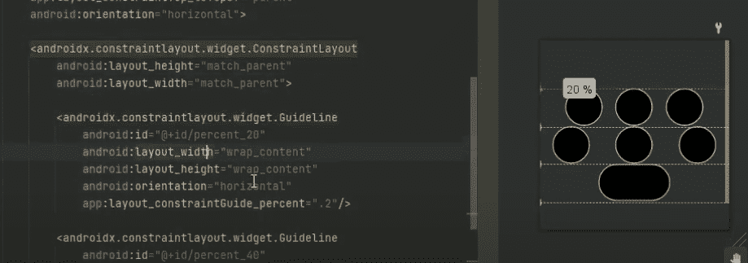

# 开发定制的 WearOS 表盘

> 原文：<https://hackaday.com/2022/06/27/developing-a-custom-wearos-watch-face/>

当你考虑定制智能手表的外观时，你可能会想象类似于在 Android 设备上选择新的壁纸，或者稍微调整一下配色方案。但不是(塞巴斯蒂安·萨布)，他的计划比所有这些都要宏大。因此，他破解了 Android Studio，并开始编写一个真正定制的手表表面，以充分利用设备的显示屏。对我们来说幸运的是，他不仅发布了源代码供其他人研究，而且在一系列视频中记录了开发过程，您可以在休息时看到这些视频。

他将新界面称为他的“披萨手表脸”，因为它将圆形屏幕分成几片，并配有一些多色“外壳”，可以用最少的像素显示各种通知。毫无疑问，这种布局能够在一个相对较小的空间里容纳大量的信息，尽管审美自然是主观的，但我们碰巧认为它看起来相当光滑。

Tweaking the tiling display code to better utilize a round display.

虽然就 Android Studio 中的模板而言，这在技术上可能是正确的术语，但我们实际上认为称之为“手表脸”有点用词不当，因为它更接近于全面的 UI 改造。正如[Sebastian]在他系列的第二个视频中解释的那样，他的设计的一部分包括一个精致的界面，用于查看从其他应用程序获取的数据，如电池电量和天气状况，使他能够以最少的点击和滑动次数最大限度地获取多少信息。

他甚至在视频系列的结尾演示了如何通过 WiFi 将 Android Studio 项目直接上传到您的 WearOS 设备上，即使您没有使用他的代码，这也是一个关于自定义人脸开发的从头到尾的宝贵指南。我们在社区中看到了对智能手表的不同反应，但即使它们不是我们所有人都特别感兴趣的东西，毫无疑问，公开更多关于与它们合作的信息是一个净积极因素。

当然，如果你[渴望真正定制的东西](https://hackaday.com/2021/10/05/hackable-smart-watch-is-also-open-source/)，也许[定制的开源智能手表](https://hackaday.com/2021/04/08/an-open-source-smart-watch-youd-actually-wear/)更符合你的要求。

 [https://www.youtube.com/embed/HRdYj2sxyGI?version=3&rel=1&showsearch=0&showinfo=1&iv_load_policy=1&fs=1&hl=en-US&autohide=2&wmode=transparent](https://www.youtube.com/embed/HRdYj2sxyGI?version=3&rel=1&showsearch=0&showinfo=1&iv_load_policy=1&fs=1&hl=en-US&autohide=2&wmode=transparent)

 [https://www.youtube.com/embed/lP3gFkrCLTc?version=3&rel=1&showsearch=0&showinfo=1&iv_load_policy=1&fs=1&hl=en-US&autohide=2&wmode=transparent](https://www.youtube.com/embed/lP3gFkrCLTc?version=3&rel=1&showsearch=0&showinfo=1&iv_load_policy=1&fs=1&hl=en-US&autohide=2&wmode=transparent)

 [https://www.youtube.com/embed/UHreih5v8HI?version=3&rel=1&showsearch=0&showinfo=1&iv_load_policy=1&fs=1&hl=en-US&autohide=2&wmode=transparent](https://www.youtube.com/embed/UHreih5v8HI?version=3&rel=1&showsearch=0&showinfo=1&iv_load_policy=1&fs=1&hl=en-US&autohide=2&wmode=transparent)

