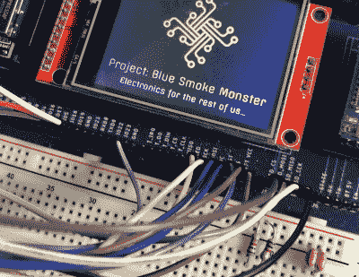

# 开发开源电子训练器

> 原文：<https://hackaday.com/2020/10/07/developing-an-open-source-electronics-trainer/>

可以肯定的是，大多数黑客读者对电子产品的兴趣始于年轻时，他们对硬件黑客世界的早期尝试可能涉及某种形式的“游乐场”套件。只要你没有丢失任何组件，这些工具包向用户承诺，数百个可能的项目只是几根跳线的距离。当你决定扔掉手册独自飞行时，额外加分。

虽然市场上仍不乏这类产品，但[乔希·基特尔]觉得这个概念需要更新一下。他的开放式硬件“微控制器训练器”又回到了那些旧的多功能工具箱，但加入了一些高科技的小配件，让现代 DIY 世界运转起来。

 它仍然有传统的布局:一个安装在中心的试验板，周围有一排发光二极管、几个按钮和一对电位计。但也有用于树莓 Pi、ESP8266、ESP32 和 Arduino 的插座。加上一些他们最受欢迎的朋友来陪伴他们:一个 0.96 英寸的有机发光二极管，2.4 英寸的触摸 TFT 和 BC05 蓝牙模块。

最初[Josh]创造这个设计是为了帮助清理他自己的工作空间，认为他可以把他最常用的组件放在一个紧凑的板上。但是正如你所料，其他人对这个概念表示了兴趣。[现在他将它们制作成套件](https://www.tindie.com/products/bluesmokemonster/practical-iot-microcontroller-trainer-rev-20/)，甚至[也在朝着第三个硬件版本](https://wiki.bluesmokemonster.com/index.php?title=Microcontroller_Trainer_Rev_3)努力，该版本增加了一些功能，如集成 18650 电池以供便携式使用。

虽然让你构建功能设备的[电子套件](https://hackaday.com/2020/07/02/review-calculator-kit-is-just-a-few-hacks-from-greatness/)是了解内情的好方法，但我们总是很高兴看到[为经典的电子“游乐场”概念](https://hackaday.com/2016/08/12/hackaday-prize-entry-a-good-electronics-learning-toolkit/)注入新鲜血液。