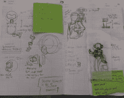

# 机器人伴侣德克斯特想给你五分钟

> 原文：<https://hackaday.com/2020/06/11/dexter-the-companion-bot-wants-to-give-you-five/>

德克斯特实验室的主角是一个天才儿童发明家，他激励了很多粉丝成为创造者和发明家。[Jorvon Moss]又名[Odd_Jayy]把自己算作他们中的一员。作为一个连续的伙伴机器人建造者，他的项目在不断发展。但每隔一段时间，他都会停下来分享施工细节。就像我们如何[建造我们自己的猴子伴侣机器人 Dexter](https://www.hackster.io/Odd_Jayy/build-your-own-robot-monkey-companion-bot-dexter-8c0c9e) 以卡通命名。

Dexter 稍早的迭代参加了 2019 年 Hackaday 超级大会。德克斯特坐在[Odd_Jayy]的背上，参加了关于同伴机器人的[演示。自从](https://hackaday.com/2020/01/31/companion-bots-definitely-are-the-droids-youre-looking-for/)[成为机器人蜘蛛](https://hackaday.com/2019/03/30/printed-perching-pals-proliferate/)和其他几个机器人[被发布到网上](https://www.hackster.io/Odd_Jayy)以来，我们一直是他的粉丝。最近在 2020 年虚拟制造商大会上，他加入了[Alex Glow]和[Angela Sheehan]来谈论他们各自制作同伴机器人和的经历。

【Odd _ Jayy】[从草图开始](https://twitter.com/Odd_Jayy/status/1247192205980078087)探索一个项目将会是什么样子和行动，力求每次都做一些新的有趣的东西。德克斯特的一个创新是给同伴机器人增加交互性。从历史上看，人们除了看一个同伴机器人之外不能做更多的事情，但德克斯特可以击掌庆祝他们的粉丝！有时，兴奋的机器猴子最终会扇[Odd_Jayy]耳光，但他们正在解决他们关系中的问题。每个人都被邀请在 [Twitter](https://twitter.com/Odd_Jayy) 和 [Instagram](https://www.instagram.com/odd_jayy/) 上看到快速循环的迭代改进。在撰写本文时，迷你德克斯特正在进行中，其设计元素类似于并行运行的“医生眼睛”护目镜项目。观看这些作品的演变总是很有趣。通过在网上和网下公开分享他的项目，[Odd_Jayy]无疑在为激励下一波创客和发明家尽自己的一份力量。

> 几周前，我们邀请了令人惊叹的 [@Odd_Jayy](https://twitter.com/Odd_Jayy?ref_src=twsrc%5Etfw) 作为嘉宾参加我的创客营直播会议。他谈到了可穿戴伴侣机器人。这个星期，我注意到我的 5YO 肩膀上有一个手工制作的小机器人。不得不抓拍一张照片。❤️🤖杰…你鼓舞了我的家人！！！谢谢大家！【pic.twitter.com/hZI2wiSiJU 号
> 
> —魔术师马里奥(@ Mario Magician)[2020 年 5 月 30 日](https://twitter.com/MarioMagician/status/1266796407832424452?ref_src=twsrc%5Etfw)