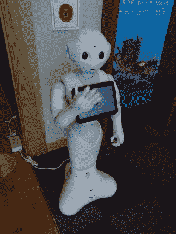

# 你见过佩珀吗？

> 原文：<https://hackaday.com/2021/07/07/did-you-meet-pepper/>

本周早些时候，有广泛报道称，软银(Softbank)的友好面孔、近乎人形的 Pepper 机器人在这个世界上不会存在太久，因为这家日本公司在法国的子公司正在裁员，生产已经暂停。它走的是索尼的艾博机器人小狗还是本田的蹲伏宇航员阿西莫的路？似乎不是，因为该公司很快回撤了一点，并煞费苦心地沟通说[关于佩珀英年早逝的报道被大大夸大了](https://abcnews.go.com/Technology/wireStory/japans-softbank-pepper-robot-remains-alive-78571707)。不久前，Pepper 还是未来家庭机器人的代言人，那么金色的未来是否已经变得有点黯淡了？也许是时候重访我们的塑料朋友了。

## 一个仍在寻找功能的产品

A Pepper earning an honest crust as a tourist guide at the Heijo Palace museum. Tokumeigakarinoaoshima, [CC BY-SA 4.0](https://commons.wikimedia.org/wiki/File:SoftBank_Pepper_which_is_working_at_Heijo_Palace.jpg).

Pepper 于 2014 年首次亮相，这是一个身材矮小、像孩子一样的机器人，具有基本的语音识别和对话技能，能够识别一些面部表情，声音与漫画风格的大眼睛相匹配。这是一个为个人互动而不是工作而制造的机器人，因为那些柔软的触觉手更适合握手而不是拿着工具。它进入了软银商店以及其他各种零售环境，还被用于实验，以评估它是否可以在医疗环境中作为伴侣机器人工作，它甚至作为啦啦队出现。没关系[它被发现充满不安全感](https://www.theregister.com/2018/05/29/softbank_pepper_robot_multiple_basic_security_flaws/)，它很快成为媒体技术专家的最爱，但它在本质上仍然是一个寻求目的的产品，而不是一个适合特定功能的现成产品。

我第一次遇到 Pepper 是在 2016 年，在英国国家计算博物馆。它只是在博物馆志愿者的监督下展出，而不是用来执行工作，它与 20 世纪 80 年代和 90 年代初的 Acorn 教室电脑展览共用了一个非常繁忙的画廊。这是一种意外和沮丧的奇怪混合，因为它肯定看到了我，让我和它握手，但顽固地拒绝交谈。也许它把自己作为人类孩子的表现看得很认真，很害羞，但最令人印象深刻的是，它除了通过触摸屏进行实验性互动之外，还没有做好任何准备。与此形成鲜明对比的是，2016 年英国首次发布了亚马逊 Echo，这是一款脱离实体的语音助手，可能没有可爱的面孔，但可以立即与主人进行有意义的互动。

## 一个人形机器人怎么能和一个没有实体的声音竞争呢？

通过比较 Pepper 和 Amazon Echo，我们可能已经找到了问题的根源。看起来很酷的东西当然很好，但是如果没有即时的功能，它将永远无法抓住顾客的心。Alexa 带来了亚马逊云计算基础设施的巨大能力，而 Pepper 不得不利用它在船上的任何东西。对于潜在客户来说，云连接麦克风带来了巨大的隐私问题并不重要，对他们来说，一个冰球大小的便宜得多的设备总是会赢得胜利，如果它能可靠地告诉他们晚上的电视时间表或提醒他们阿姨的生日。

在接下来的十年里，我们将会看到价格低廉的紧凑型处理能力的到来，它可以完成更多亚马逊目前使用云的工作。也许 Pepper 永远不会完全获得这一特殊的升级，但可以肯定的是，如果软银不这样做，那么别人会这样做。与此同时，另一家法国公司提醒人们，在家庭助理市场上领先和可爱并不能保证成功，[谁还记得 Nabaztag](https://hackaday.com/2020/05/26/teardown-nabaztag/) ？

表头:Tokumeigakarinoaoshima， [CC0](https://commons.wikimedia.org/wiki/File:SoftBank_pepper.JPG) 。