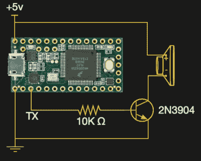

# 微控制器的数字音频不会比一个疣更简单

> 原文：<https://hackaday.com/2021/07/11/digital-audio-for-microcontrollers-doesnt-come-much-simpler-than-a-wart/>

向您的微控制器项目添加音频通道可能意味着大量额外的元件和大量的处理能力，因为必须检索压缩流并将其发送到专用 DAC。或者，如果你是[rdpoor]，这可能意味着[将一个低通滤波器连接到 UART，即使是最简单的设备](https://hackaday.io/project/180530-wart-really-cheap-audio-playback)上也存在 UART，并构建一个模拟 PWM 音频的串行数据流。

Sound on your microcontroller, it’s this simple!

WART 是一个 Python 脚本，它可以将 WAV 文件转换成 C 格式的字节数组，该数组可以嵌入到您的微控制器代码中，播放起来就像将其传输到 UART 一样简单。该示例使用一个扬声器和一个晶体管来驱动一个小扬声器，我们猜测使用专用的低通滤波器可能会比依赖扬声器本身获得更好的质量，但至少音频不会变得更简单。

[代码可以在 GitHub 库](https://github.com/rdpoor/WART)中找到，在 Hackaday.io 页面的文件部分有一些输出[的记录，下面嵌入了一个。这比我们预期的要好，因为即使是最快的 UART，在 PWM 数据速率下，质量也不是最好的。但是，即使你不会很快将它整合到你的音乐系统中，我们也可以看到它是一个有用的补充，比如小的警告声音。与此同时，如果说服连续驱动的演讲者是有趣的，那么总会有](https://hackaday.io/project/180530-wart-really-cheap-audio-playback#menu-files)[这位德高望重的 PC 演讲者](https://hackaday.com/2021/06/21/rf-burns-and-exploding-pc-speakers-sophos-looks-at-the-evidence/)。

<https://cdn.hackaday.io/files/1805307723795520/Rolling.wav?_=1>

[https://cdn.hackaday.io/files/1805307723795520/Rolling.wav](https://cdn.hackaday.io/files/1805307723795520/Rolling.wav)