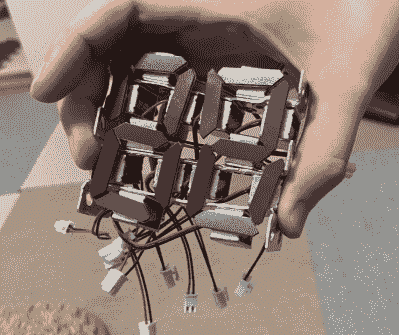

# 数字沙漏倒计时

> 原文：<https://hackaday.com/2022/10/26/digital-hourglass-counts-down-the-seconds/>

如果有人让你做一个数字沙漏，你的设计会是什么样子？[ BitBlt_Korry]接受了这一挑战，创造了一件恰到好处的功能性艺术品:[一个带数字显示的沙漏](https://twitter.com/BitBlt_Korry/status/1583775277842583552)。

铁屑落在两片有机玻璃之间，同时幽灵般的数字出现，倒计时 30 秒。数字出现的速度很快，消失的速度也很快——落在外壳的底部。每一秒钟都被可能是我们听到过的最大的时钟滴答声所打断。

 当然，这不全是魔法。沙漏由在 MicroPython 中运行的 Raspberry Pi Pico 代码控制。pico 驱动一系列晶体管，这些晶体管又用来控制 14 个螺线管。螺线管有双重功能——首先，它们将扁平的“冰箱磁铁”材料移动到足够近的地方，以吸引铁屑。他们的第二个职责当然是提供一个肯定会引起你注意的时钟滴答声。

倾斜传感器是沙漏的用户输入，让 Pi Pico 知道何时开始新的 30 秒倒计时。

[ BitBlt_Korry]提到，这个项目最困难的部分是在沙漏的顶部和底部安装螺丝，以获得铁屑的完美均匀流动。

[ BitBlt_Korry]称他的作品为“時場(じば)」".谷歌将此翻译为“Jiba”，意为“磁场”。我们不是以英语为母语的人，但我们猜测这里有双重含义。

这不是我们第一次看到卑微的铁屑在我们的命令下站起来跳舞。如果铁粉是一个过于干燥的话题，我们已经有[大量](https://hackaday.com/2021/11/12/is-this-12-layer-pcb-coil-the-next-step-in-ferrofluid-displays/)的[铁磁流体](https://hackaday.com/2021/08/26/ferrofluid-display-gets-new-better-driver-circuitry/)项目[以及](https://hackaday.com/2021/04/21/ferrofluid-dances-in-custom-bluetooth-speaker/)！

 [https://www.youtube.com/embed/OPkJQPaLwWM?version=3&rel=1&showsearch=0&showinfo=1&iv_load_policy=1&fs=1&hl=en-US&autohide=2&wmode=transparent](https://www.youtube.com/embed/OPkJQPaLwWM?version=3&rel=1&showsearch=0&showinfo=1&iv_load_policy=1&fs=1&hl=en-US&autohide=2&wmode=transparent)

