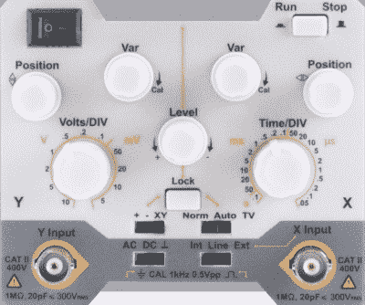

# 数字示波器实现最佳模拟效果

> 原文：<https://hackaday.com/2019/09/10/digital-oscilloscope-does-its-best-analog-impression/>

你有没有发现自己向往数字存储示波器(DSO)出现之前的日子？即使是基本的瞄准镜也能达到四位数，而且外形也很棒。不，你当然不知道。DSO 是现代技术的一个奇迹:只需几百美元，你就可以拥有以前业余爱好者无法企及的功能，所有这些功能都集成在一个足够小的包中，甚至可以放在最狭窄的工作台上。

 这就是为什么[EEVblog 论坛的好人们对 OWON AS101](https://www.eevblog.com/forum/testgear/latest-innovation-by-owon-as101/) 感到如此困惑，这是一种现代数字示波器，其外观和操作都像过去的模拟 CRT 怪物。尽管有 3.7 英寸的液晶显示器，但用户仍被视为经典的模拟示波器外观，前面的开关和旋钮应该会引发特定年龄黑客的怀旧潮。

但这不仅仅是一些“复古”的外观，OWON 致力于通过消除我们变得如此依赖的所有现代数字功能来提供模拟体验。这种单通道示波器不能将数据保存到 USB，没有任何协议解码功能，并且忘记了自动…嗯，任何东西。它甚至被限制在 20 MHz，就像你在任何交易会上为一首歌挑选的老派 CRT 示波器一样。所有的一切都是为了从通常的进口商那里得到 150 美元的低价。

在 EEVblog 主题中，任何人都可以想到的最佳想法是，OWON AS101 是为发展中国家的教育市场设计的，在这些国家，过时的设备非常普遍，实际上可能需要仿模拟示波器来匹配已经在使用的示波器。这些新制造的“模拟”训练器可以用来让学生为使用过时技术的职业生活做好准备。这很难相信，但有时我们会忘记我们中的许多人是多么幸运，可以很容易地获得廉价的工具和设备。

尽管如此，[当你能以大约 50 美元](https://hackaday.com/2018/08/06/review-a-20-mhz-pocket-scope-for-not-a-lot/)买到一个袖珍的 10 MHz 数字示波器时，很难想象这种模数混合怎么可能以 3 倍的价格吸引任何人。如果我们的任何读者愿意透露一些关于这个不寻常的齿轮，我们很乐意听到它。

 [https://www.youtube.com/embed/tcDg4u2haPQ?version=3&rel=1&showsearch=0&showinfo=1&iv_load_policy=1&fs=1&hl=en-US&autohide=2&wmode=transparent](https://www.youtube.com/embed/tcDg4u2haPQ?version=3&rel=1&showsearch=0&showinfo=1&iv_load_policy=1&fs=1&hl=en-US&autohide=2&wmode=transparent)

感谢大卫的提示。]