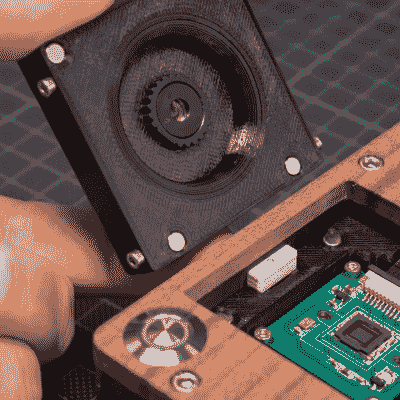

# 数码“玩具”相机，为倾斜移位和其他类似模拟的实验

> 原文：<https://hackaday.com/2022/07/23/digital-toy-camera-made-for-tilt-shift-and-other-analog-like-experimenting/>

像许多其他人一样，[volzo]喜欢以一种有趣和实验的方式玩摄影。古怪的镜头，复古的元素，从套件中构建就是那个世界的样子。但是这种东西真的是胶片相机的领域，或者至少在[volzo]创造出他的[数码玩具相机](https://volzo.de/thing/digitaltoycamera/)设计之前是这样。结果呢？一个自建的， [lomography](https://en.wikipedia.org/wiki/Toy_camera#Lomography) 友好的数码相机，允许各种怪异和精彩的附件和照片恶作剧。

3D-printed mounts and magnetic attachment makes swapping parts a breeze.

要制作一台可以玩这种游戏的 DIY 数码相机，volzo 必须解决的第一个问题是决定图像传感器。事实证明，以个人身份采购图像传感器是一个非常繁琐的过程，即使成功了，也仍然需要编写驱动程序并从头开始创建东西。因此，[volzo]的创作使用了 Raspberry Pi 和相机传感器生态系统以及 M12 镜头，这一决定使他可以专注于相机的其他部分。

3D 打印，一点 CNC 加工和一些巧妙的设计产生了一个“玩具”相机:简单，便宜，并使人们能够采取一种有趣的和实验性的摄影方法。GitHub 上提供了[设计文件，其中有一些简洁的设计元素。磁性底座可以轻松更换镜头组件，M12 x 0.75 丝锥可以在 M12 镜头的 3D 打印件上切割出完美的螺纹。](https://github.com/volzotan/tlpic)

热定形嵌片还提供了牢固的紧固，可以承受拆卸和重新组装(不要错过我们自己的【约书亚·瓦斯奎兹】分享了[如何最好地设计和使用热定形嵌片](https://hackaday.com/2019/02/28/threading-3d-printed-parts-how-to-use-heat-set-inserts/))。)

[volzo]有一个梦幻般的视频来配合他的项目；给它一个手表(嵌在下面，在分页符下面)，看看你是否没有自己的一些灵感。

 [https://www.youtube.com/embed/PLE8osLom30?version=3&rel=1&showsearch=0&showinfo=1&iv_load_policy=1&fs=1&hl=en-US&autohide=2&wmode=transparent](https://www.youtube.com/embed/PLE8osLom30?version=3&rel=1&showsearch=0&showinfo=1&iv_load_policy=1&fs=1&hl=en-US&autohide=2&wmode=transparent)

