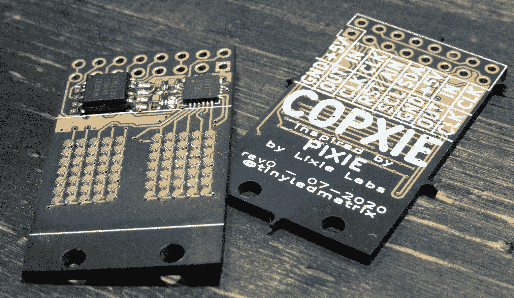

# 分立的发光二极管构成微型显示器

> 原文：<https://hackaday.com/2020/12/24/discrete-leds-make-a-micro-display/>

没有什么比发光的 LED 灯更能让一个普通员工兴奋的了，所以把它们组合成一个矩阵真的能让我们前进也就不足为奇了。让这个矩阵变得微小、可寻址、可链接，你知道它会在虚拟饮水机上大受欢迎。我们以前看过[tinyledmatrix]的作品，但他带着[COPXIE 回来了，这是一个 PCBA 上的一对微型可寻址显示器](https://hackaday.io/project/174310-copxie-chainable-dual-57-tiny-led-matrix)。

在顶部看到的样品板是一个特别引人注目的组合奥什公园后，黑暗的 PCB 和神秘的紫色 SMT 发光二极管，真正解释了整个前提。每个 PCBA 包含两组分立的 led，每组排列成一个 5×7 的显示屏。这里有足够的密度来容纳完整的拉丁字符集和简单的图标和图形，因此应该有足够的灵活性来容纳所有 NTP 同步的桌面时钟和火车时刻表，这可能是一个暂时痴迷的黑客想要的。

但是显示器的质量取决于 SDK，对吗？COPXIE 实际上是为了替代不同系列的微型 LED 矩阵而设计的，由[谢利实验室开发的[PIXIE。为了完成这个效果，COPXIE 运行了](https://connornishijima.github.io/Pixie/extras/datasheet.html)[相同的固件](https://github.com/connornishijima/Pixie)，因此具有相同的功能集。每个模块(有两个显示器)可以用两个引脚(数据和时钟)控制，超过 12 个模块(24 个显示器)的链可以串在一起。此外，还有一个方便的 Arduino 友好库，使控制变得轻而易举。

要创建自己的副本，请查看 Hackaday.io 页面上链接的[示意图，以及奥什公园共享链接](https://hackaday.io/project/174310-copxie-chainable-dual-57-tiny-led-matrix)上的[布局。请注意，似乎[tinyledmatrix]可能没有完全验证这些板，但鉴于有大量它们工作的照片，它们似乎是一个安全的赌注。](https://oshpark.com/shared_projects/gF1VQ7jz)