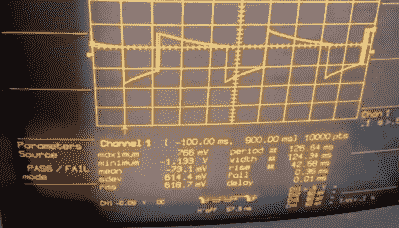

# 剖析机械调压器

> 原文：<https://hackaday.com/2020/04/20/dissecting-a-mechanical-voltage-regulator/>

当他 1975 年的凯旋 Spitfire 的燃油表开始超出刻度时，互联网上收集的信息表明[smellsofbikes]需要更换仪表板后面有故障的电压调节器。对大多数人来说，这将是故事的结尾。但是他，像现在正在读这篇文章的每个人一样，[真的很想看看一个 45 年前的稳压器内部是什么样子的](https://www.youtube.com/watch?v=WlZekK97ntg)。

撬开金属外壳后，他发现调节器不仅是机械性质的，甚至还有一个小小的螺丝可以让你调整输出电压。对我们来说幸运的是，[smellsobikes]不仅有足够的好奇心来打开它，而且他还拥有工具和知识来在休息后的视频中解释它是如何工作的。

 简单来说，调节器的心脏是一个双金属片，上面缠绕着一圈金属丝。当电池的电能通过线圈时，线圈就像一个加热器，使金属条向上移动，断开与可调触点的连接。随着连接的断开，加热线圈从条带上快速冷却，并且在这样做时返回到其初始位置并重新连接加热器；从而再次开始该过程。

这些快速电压脉冲平均约为 10 VDC，尽管[smellsobikes]指出，你实际上无法用电表测量稳压器的输出电压，因为它移动太多，无法获得任何准确的读数。他还提到了这项技术的一个独特之处:由于重力作用在双金属片上，调节器的输出实际上会根据其安装方向而变化。

在示波器上，[smellsobikes]能够向我们展示输出的实际样子。正如你所料，在 21 世纪的眼中，这看起来一片混乱。但这是更简单的时代，不言而喻，1975 年的跑车上没有任何敏感的电子设备。有趣的是，他说他现在用一个现代的调节器芯片代替了机械组件。希望我们能活得够久，看看他是否能再活 50 年。

 [https://www.youtube.com/embed/WlZekK97ntg?version=3&rel=1&showsearch=0&showinfo=1&iv_load_policy=1&fs=1&hl=en-US&autohide=2&wmode=transparent](https://www.youtube.com/embed/WlZekK97ntg?version=3&rel=1&showsearch=0&showinfo=1&iv_load_policy=1&fs=1&hl=en-US&autohide=2&wmode=transparent)

