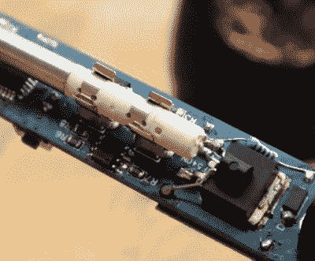

# DIY Arduino 烙铁热卖版 2.0

> 原文：<https://hackaday.com/2018/09/22/diy-arduino-soldering-iron-hits-version-2-0/>

几个月前，我们得到消息说[electronio OBS]正在开发他自己的开源替代物，以替代像 TS100 这样的袖珍型温控烙铁。由 ATMega328p 微控制器提供动力，并利用 3D 打印外壳，他的版本可以以 15 美元的价格建造，这取决于你从哪里采购零件。但他自己承认，他设计的 5 美元的替换烙铁头的质量阻碍了这一设计。俗话说，你得到你所付出的。

 但是[【电子人】带着他的 DIY 便携式烙铁](http://www.electronoobs.com/eng_arduino_tut42.php)的第二个版本回来了，这一次它使用了非常高级的 HAKKO T12 风格的烙铁头。由于这个技巧将热电偶和加热元件串联在一起，所以它涉及到整个项目相当广泛的重新设计，但最终还是值得的。毕竟，烙铁实际上只和它的尖端一样好。

这个版本的熨斗删除了在 V1 使用的 MAX6675，代之以 LM358 运算放大器，以读取 T12 尖端的热电偶。[Electronoobs]然后使用外部热电偶将 LM358 的输出与尖端的实际温度进行比较。利用这些数据，他创建了一个从模拟电压返回尖端温度的函数。

虽然尖端的物理和电子元件发生了实质性的变化，但许多设计仍然与第一版相同。除了 ATMega328p 微控制器，2.0 版本的 iron 仍然使用与原始 iron 相同的 128×32 I2C 有机发光二极管显示器、MOSFET 和 5V 降压转换器。也就是说，[electronio OBS]已经在考虑第三次修改，通过替换 MOSFET 和降压转换器，将铁做得更小。这可能是 DIY 熨斗最终成型之前的一个中间步骤，我们对此非常感兴趣。

DIY Arduino 烙铁的第一个版本获得了相当多的关注，所以似乎有相当多的人不满足于仅仅由[为 TS100](https://hackaday.com/2017/07/24/review-ts100-soldering-iron/) 掏钱。

 [https://www.youtube.com/embed/lkk1_jE9Q_s?version=3&rel=1&showsearch=0&showinfo=1&iv_load_policy=1&fs=1&hl=en-US&autohide=2&wmode=transparent](https://www.youtube.com/embed/lkk1_jE9Q_s?version=3&rel=1&showsearch=0&showinfo=1&iv_load_policy=1&fs=1&hl=en-US&autohide=2&wmode=transparent)

【感谢 BaldPower 的提示。]