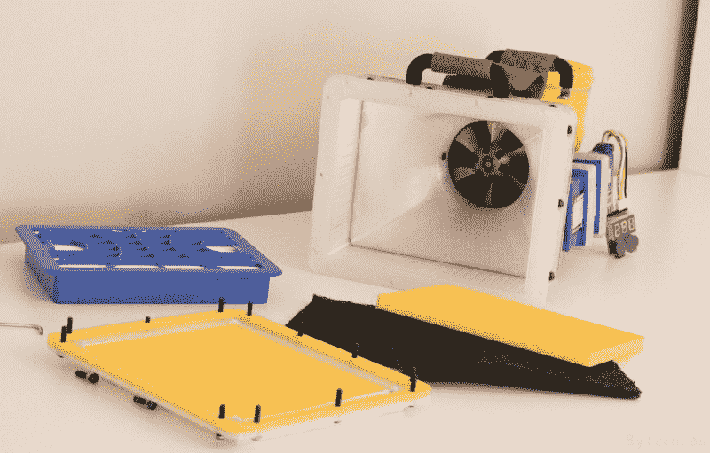

# DIY 过滤正压服彰显做工精细

> 原文：<https://hackaday.com/2020/07/03/diy-filtered-positive-pressure-suit-shows-fine-workmanship/>

【安德鲁】的[空气过滤装置&正压供应](https://bytechlab.com/2020/04/covid-19-air-filtering-unit-and-pressure-suit/)可能看起来像是来自*捉鬼敢死队*的场景，但这是一个制作临时(但可行)正压服的实验。这个想法是为本质上是一个可充气的软头盔提供过量的过滤空气。佩戴者可以呼吸过滤后的空气，而正压意味着没有其他东西进入。这肯定是一个复杂的构建，使用了他手头上的一些特定硬件，但做工很棒，显示了一些深思熟虑的设计元素。

 该装置有三个堆叠的过滤器，可以很容易地交换。第一阶段是医用口罩材料，旨在捕捉大多数大颗粒，由蜂窝框架支撑。下一个过滤器是用垫圈密封的现成的 HEPA 过滤器；这些有各种各样的尺寸和形状，所以[Andrew]选择了一个合适的。第三级也是最后一级是活性炭过滤器，与第一级一样，由蜂窝框架支撑。这个想法是，通过所有三个过滤器的空气呼吸起来是安全的(或至少是安全的)。头盔部分不需要防漏，因为相对于环境的正压意味着没有东西可以进入。

空气通过过滤器被吸入，并通过 HP BLc7000 服务器风扇装置转移到头盔上，他手头上有这种风扇装置，但在易贝也很容易买到。这些风扇装置能够铲出惊人数量的空气，如果你不介意在这个过程中产生惊人数量的噪音，所以虽然堆叠的过滤级肯定会阻碍气流，但风扇装置可以轻松处理它。BLc7000 不是一个简单的 DC 马达，它需要一个驱动器，所以作为参考，[Andrew]在 YouTube 上有一个简短的视频，展示了风扇是如何工作的。

所有的 3D 模型和设计文件[都可以在网上](https://grabcad.com/library/covid-19-air-filtering-unit-pressure-suit-1)找到，如果有人想仔细看看的话。用相当普通的材料制作一个过滤正压供给和头盖，这当然是一个很好的实验。如果[安德鲁]想换成全身套装，也许[可以把一套旧的万圣节服装改造成一套耐用的正压服](https://hackaday.com/2020/05/09/halloween-costume-turned-positive-pressure-suit/)。