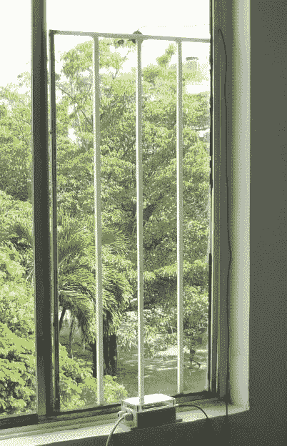
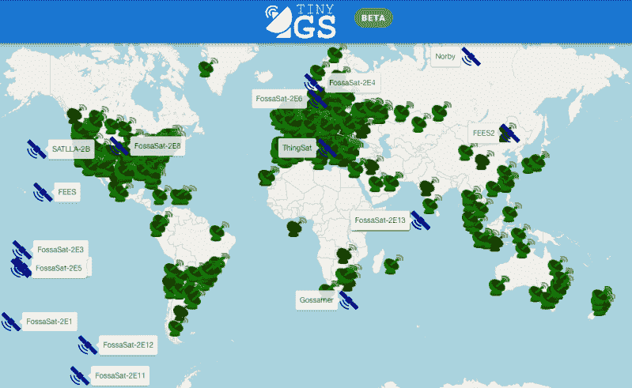

# DIY 低成本 LoRa 卫星地面站

> 原文：<https://hackaday.com/2022/07/07/diy-low-cost-lora-satellite-ground-station/>

嵌入式工程师[阿尔贝托·努内斯]已经组装了一个小巧的 LoRa 卫星遥测地面站,它可以放在你的手中，造价大约 40 美元。

 该站接收任何一颗使用 LoRa 进行遥测的卫星的信号，如[fossat](https://fossa.systems/)系列 [PocketQube](https://en.wikipedia.org/wiki/PocketQube) 卫星。即使有一个由粘在窗外的磁性安装天线组成的次优设置，[Alberto]也能够接收来自 2000 公里以外的卫星的遥测数据。他还制造了一种更小的电池驱动的便携式电池。

该地面站的建设利用了标准的现成项目，以 Heltec ESP32 为基础的 LoRa / WiFi 模块为核心。该模块是由 TinyGS 项目支持的几个模块之一，在撰写本文时，该项目提供接收器固件和由 1002 个站组成的全球遥测网络。该固件有很多功能，包括 OTA 更新和自动调谐接收器，以捕捉每颗经过头顶的卫星。

TinyGS 项目始于 2019 年的一个周末项目，使用 ESP32 接收来自[fossa at-1](https://hackaday.com/2019/08/15/spains-first-open-source-satellite/)卫星的 LoRa 遥测数据，并已扩展到包括所有卫星和其他飞行物体，使用基于 LoRa 的遥测数据。它使用电报来分发数据，只要网络中的任何一个站收到来自卫星的遥测数据包，就会有一条消息发送到该信道。

如果你有兴趣尝试接收卫星信号，这是一个简单的项目，不会让你破产。

