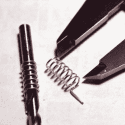

# 从回收的同轴电缆 DIY 迷你螺旋天线

> 原文：<https://hackaday.com/2018/11/19/diy-mini-helical-antennas-from-salvaged-co-ax-cable/>

[Mare]为 LoRa 应用制作 DIY 迷你螺旋 868 MHz 天线提供了可视化指南和简单说明。868 MHz 在欧洲是一个免许可证的频段，这种方法产生了一个完全可用的天线，在空间有限的地方很有用。

A metric 5 mm drill bit makes a convenient core.

这一过程很简单，也有很好的记录，但和通常的天线设计一样，它需要注意细节。天线的电线是镀银的铜，从 RG214U 同轴电缆的核心回收。拉直后，金属丝紧紧地缠绕在 5 毫米的芯上。7 圈每圈小心地间隔 2 毫米。之后，只是测量和弯曲焊接到无线设备的问题。[Mare]已经将这种方法用于空间受限设计中的无线 LoRa 传感器，并且它还具有降低零件成本的优势，因为它可以在内部制造和测试。

天线当然是由比废弃电线更奇怪的东西制成的；我们最喜欢的一个是由卷尺制成的八木天线。