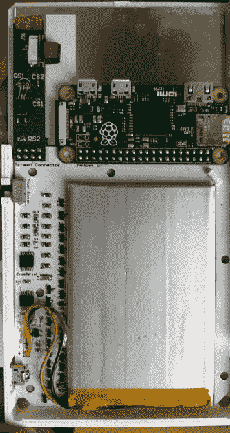

# 由 Pi Zero 驱动的 DIY 科学计算器

> 原文：<https://hackaday.com/2018/08/07/diy-scientific-calculator-powered-by-pi-zero/>

这是黑客们面临的永恒问题:你是构建它，还是购买它？电子产品的低成本和高可用性意味着我们越来越多地选择后者。尤其是因为构建自己的版本往往比购买一个商业产品花费更多；这是之前的*,你要考虑你要花在这上面的时间。*

 但这样的担忧显然不相【安德烈·卡瓦利】。当然，他可以只买一个科学计算器，但这不会真的是他的科学计算器。相反，他走的是风景优美的路线，从头开始建造自己的科学计算器。外壳是 3D 打印的，PCB 是定制的，连软件都是他自己创作的。

他的 PCB 直接挂在内部 Raspberry Pi Zero 的 GPIO 引脚上，使得与圆顶开关键盘的接口非常容易。该板还支持器件的电源管理硬件，包括物理电源开关、充电 USB 连接和 TPS79942DDCR 线性稳压器。

包括按钮在内的外壳完全是 3D 打印的。在这一点上，按钮上实际上没有任何标签，这可能会使计算器使用起来有点困难，但毫无疑问[Andrea]正在为硬件的后续版本努力。一个特别好的细节是访问 Pi 的微型 SD 卡的舱口，使其易于更新软件或完全切换操作系统，而不必拆开计算器。

在内核消息滚动之后，Pi 直接启动到 Java 计算器环境中。这为用户提供了一个相当标准的科学计算器体验，包括变量突出显示等漂亮的修饰。马里奥迷你游戏可能不是严格要求的，但是如果你在为自己的计算器编写代码，你可以做任何你想做的事情。

在 Hackaday 这里，我们已经看到[一个升级了 Raspberry Pi 的计算器](https://hackaday.com/2018/03/04/graphing-calculator-dual-boots-with-pi-zero/)，一个用 Arduino 模拟的经典[科学计算器，当然我们也对](https://hackaday.com/2018/06/22/your-own-sinclair-scientific-calculator/) [NumWorks 开源图形计算器](https://hackaday.com/2018/05/18/open-source-calculator-teaches-us-about-quality-documentation/)赞不绝口。尽管竞争如此激烈，我们认为这个项目很有希望成为我们遇到的最令人印象深刻的计算器之一。

 [https://www.youtube.com/embed/dd2a9_wmQD8?version=3&rel=1&showsearch=0&showinfo=1&iv_load_policy=1&fs=1&hl=en-US&autohide=2&wmode=transparent](https://www.youtube.com/embed/dd2a9_wmQD8?version=3&rel=1&showsearch=0&showinfo=1&iv_load_policy=1&fs=1&hl=en-US&autohide=2&wmode=transparent)

