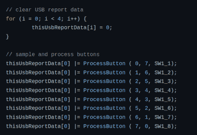

# DIY“固态硬盘”把四个字节放进你的口袋

> 原文：<https://hackaday.com/2022/01/23/diy-solid-state-drive-puts-four-bytes-in-your-pocket/>

在相对较短的时间内，USB 闪存驱动器的平均容量飙升。不久前，2 GB 和 4gb 的硬盘还被认为是高端产品，但今天你可以用不到 50 美元的价格买到 512 GB 的硬盘。事实上，它们已经变得如此之大，以至于在一些任务中使用它们会感到浪费，我们偶尔会发现自己希望能够找到一些现代的 USB 驱动器，这些驱动器的存储容量不能与我们整个计算机的存储容量相媲美。

也就是说，这个由[Glen Akins]创造的[USB-C 四字节驱动器可能对我们的口味来说*稍微*小了一点。不，那不是印刷错误。就像在希腊语 tetra 中一样，这个驱动器一次可以容纳大量的四个字节。更好的是，你不需要一台电脑来写它:32 个 DIP 开关让你一点一点地输入内容。](https://github.com/bikerglen/usb-tetrabyte-ssd)

Reading out the first byte from the DIP switches.

正如[在 Twitter 帖子](https://threadreaderapp.com/thread/1484017857696464898.html)中解释的那样，【Glen】在另一位用户于 12 月发布了一张 32 位双列直插式开关的图片，并附有说明，称其为“ [One Tetrabyte SSD](https://twitter.com/NanoRaptor/status/1473796625403301888) ”后，受到启发，创作了这个小工具。他显然找不到同一个开关，但四个红色的 Grayhill 76 系列开关可以说让你在输入字节时更清楚一点。

每个 DIP 开关都连接到 8 位 EFM8UB2 微控制器的一个 GPIO 引脚，代码只需按顺序读取每个引脚的状态，并将二进制结果保存在一个变量中，以便将插入时呈现给操作系统的“文件”放在一起。

[过去](https://hackaday.com/2020/07/17/usb-flash-drive-reveals-strange-sd-card-heart/)我们已经看到了[不寻常的 USB 闪存驱动器的公平份额](https://hackaday.com/2008/07/30/shell-case-your-flash-drive/)，但这一个确实是独一无二的。不能说我们能想到任何四个字节的数据重要到足以保存在一个专用的硬件上，但我们当然感谢以最健壮的方式存储它的努力。

感谢[J. Peterson]的提示。