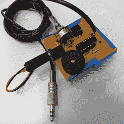

# 不会按开关的人 DIY 开关

> 原文：<https://hackaday.com/2018/09/10/diy-switches-for-people-who-cant-push-switches/>

大多数人认为理所当然的许多事情给身体残疾的人带来了巨大的障碍，包括与计算机和其他数字资源的互动。自适应开关等辅助技术允许无法使用传统按钮或其他输入设备的用户与数字设备进行交互，尽管有商业产品，但像[Cassio Batista]的[DIY 低成本辅助技术开关](https://hackaday.io/project/46483)这样的项目仍有很大的空间。

[凯西奥]的项目侧重于非接触式开关，如接近和基于喷烟的激活。这些都是经济实惠的 DIY 选项，旨在为那些甚至无法亲自按下专门开关的人提高可访问性。这一领域已经有了一些产品，但是成本可能是一个障碍，使用熟悉界面的 DIY 选项大大提高了易用性。

辅助技术为人们提供了他们需要的工具，使他们能够以积极、健康的方式更多地控制自己的生活，这是开放硬件开发中更加活跃和积极的领域之一，在创建解决方案时，并不总是清楚挑战在哪里。这方面的一个例子是 2015 年 Hackaday 奖的获奖者 [Eyedrivomatic](https://hackaday.com/2015/11/17/the-gaze-controlled-wheelchair-that-won-the-hackaday-prize/) ，它允许人们将电动轮椅的转向与目光跟踪系统相连接，同时永久改变这两个设备；这是必要的，因为用户通常不拥有自己的硬件。

The [HackadayPrize2018](https://hackaday.io/prize) is Sponsored by:     