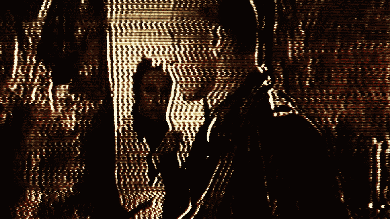

# DIY Vactrols 提供 MIDI 控制的视频失真

> 原文：<https://hackaday.com/2019/05/26/diy-vactrols-give-midi-controlled-video-distortion/>

使用现成的元件从头开始组装自己的电路是一回事。先造元器件，再造电路，完全是另一回事。

这就是 Joris Wegner 用这个被称为磷光体的视频失真效果盒所走的路。有人可能想知道为什么你想要一个盒子，让视频流看起来像是从 20 世纪 80 年代有跟踪问题的 VHS 播放器播放的，但话说回来，为了艺术效果而失真音频是一件事，为什么视频不可以呢？PHOSPHOR 是一种 USB MIDI 设备，因此需要定制组件。[Joris]很难找到阻性光隔离器，通常称为 Vactrols，用于控制失真效应。他需要一个动态范围宽的东西，所以他把一个亮白色的 LED 和一个硫化镉光敏电阻放在一根热缩管里。总共制造了 20 个 Vactrols，并安装在 PCB 上，这是我们见过的最酷的丝网印刷之一，以及负责 MIDI 杂务的 Sparkfun Pro Micro。现在，视频的失真可以保存为预设，并与音乐同步播放，以达到艺术效果。

当然，这不是机器人第一次在这里出现。不久前，我们看到他们推出了这款 Arduinofied 电吉他，最近又推出了一款 triple-555 timer synth(T3)，这款产品名为[。](https://hackaday.com/2019/04/05/fizzle-loop-synth-does-it-with-555-timers/)

