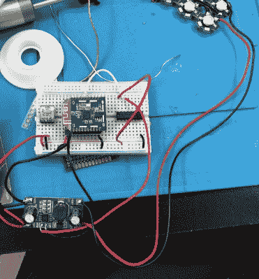

# DIY ZigBee 治疗灯是色调兼容的

> 原文：<https://hackaday.com/2019/08/23/diy-zigbee-therapy-lights-are-hue-compatible/>

对于我们黑客来说，工作到凌晨并不罕见，但是如果你一直睡到下午，你可能患有延迟相睡眠障碍(DPSD)。简而言之，你身体的生物钟与你周围的世界不一致。治疗这种情况的方法之一是在早上将自己暴露在明亮的光线下，这可以帮助你醒来并感到更加精神焕发。不幸的是，这些所谓的“强光疗法”盒子往往相当昂贵。

 在寻找一种治疗他自己的 DPSD 的方法，[【爱德华·申】决定基于他对](http://edwardsh.in/2019/07/22/hue-compatible-therapy-lights)在那里的各种商业产品所做的研究来建造他自己的灯箱。毕竟，一个装满明亮灯光的盒子，并不是特别复杂。当然，实际上还不止这些，但是到目前为止，结果肯定是有希望的。

[爱德华]要做的第一个决定是他想要什么样的光线。通常用于治疗季节性情感障碍(SAD)的经典光疗设备往往是尝试和模拟阳光的全光谱灯。但在他的研究中，他发现了一篇来自《自然》杂志的论文，该论文解释了人眼中的黑色素主要对蓝光和绿光做出反应。但是强烈的蓝光显然会导致黄斑变性，所以他决定用绿色。

由于[Edward]已经将飞利浦色调系统用于家庭照明，他希望将他的治疗灯引入生态系统。这个想法是，他可以很容易地安排他的新的绿色灯箱在他早上想醒来的时候打开。因此，他使用 Seeed Studio 的 Mesh Bee，它不仅支持 ZigBee，还提供了模拟色调灯泡的软件。然后，他只需要搭配一个足够强大的 LED 驱动器和一些 510 纳米的发射器。所有东西都装在一个由激光切割木材制成的盒子里，这个盒子被设计成悬挂在床头板上，照在他的脸上。

[这些年来，我们已经看到许多](https://hackaday.com/2008/12/29/light-therapy/)类似的[项目试图解决 SAD](https://hackaday.com/2015/12/02/diy-lamps-brighten-winter-blues/) ，所以黑客调整概念来解决 DPSD 的想法似乎是这个想法的一个足够自然的演变。只是记得在想出自制治疗方案之前，先和医学专家谈谈。