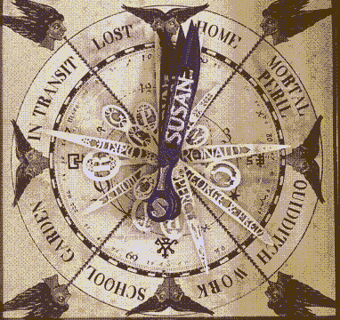

# 你知道你的孩子在哪里吗？检查韦斯莱钟

> 原文：<https://hackaday.com/2020/07/29/do-you-know-where-your-children-are-check-the-weasley-clock/>

除了能用的魔杖或魁地奇扫帚，你还能为哈利波特迷做什么最酷的东西？我们不得不说，一个显示家庭中每个人行踪的韦斯莱钟是非常重要的，特别是如果这个粉丝是妻子和母亲的话。

 事情是这样的:他们建立了地理围栏来界定家庭、每个人的学校或工作场所等的界限。这家人的位置是通过他们的手机 GPS 使用家庭助理来跟踪的，这是在树莓 Pi 上托管的。[每当有人的位置发生变化，Pi 会通过 MQTT 提醒时钟，它会通过伺服系统移动 3D 打印的指针](https://www.google.com/url?q=https%3A%2F%2Fgithub.com%2Frandomstring%2FWeasleyClock&sa=D&sntz=1&usg=AFQjCNHNveEvGJV1BH2Ehxfr2Mwca036lQ)。

时钟也有一些有趣的粒度。当某人离家越来越近时，他的指针的距离反映了他与本垒片的接近程度。家本身分为主屋和商店，并通过指针的位置反映出来。

[我们特别喜欢这里对细节的关注](https://photos.google.com/share/AF1QipNUsvWGfobD1rROC1tlB9oIbrr1pvA1cnJns-4AaMAe8nonIq-fYJb66pnQ0RJT0g?key=WFZaRUMzTnB0SV9tT2RORlB0VnU0WkhWOHpjblln)，比如用于钟面的艺术海报，包括背景中韦斯莱一家的所有行踪。它内置于旧货店的老奶奶钟，比老爷钟小，但同样雄伟。将来有计划实现时钟的钟声来宣布有人回家了。

不管你喜欢什么，行踪钟的想法可能适合那个宇宙。例如，[这里有一个用乐高迷你无花果头](https://hackaday.com/2012/07/30/magic-clock-locates-your-friends/)来定位室友。