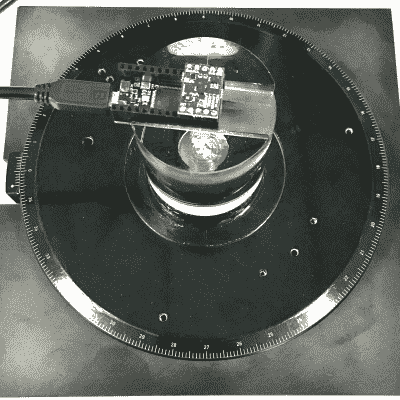
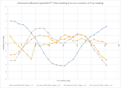

# 你知道你的无人机要去哪里吗？HJWYDK 文章探讨 MEMS 传感器的局限性

> 原文：<https://hackaday.com/2019/03/12/do-you-know-where-your-drone-is-headed-hjwydk-article-explores-limits-of-mems-sensors/>

知道你的机器人指向哪个绝对方向可能是至关重要的，像美国宇航局在火星上使用的那些昂贵的系统能够计算这个六维方向向量，误差在 1 度 RMS 左右，但它们相当昂贵。如果您希望在黑客预算内获得类似的精度，本文将向您展示如何使用廉价的 MEMS 传感器、现成的运动协处理器 IC 和正确的校准方法来实现。

发表在我们自己的同行评审 Hackaday 期刊上的最新文章是 *[使用廉价 MEMS 传感器的绝对航向精度限制](https://hackaday.com/wp-content/uploads/2019/03/hackaday_journal-gregorytomasch_kriswiner-heading_accuracy_using_mems_sensors.pdf)* (PDF)。在本文中，Gregory Tomasch 和 Kris Winer 仔细研究了几种算法与两种不同的 MEMS 传感器组合可以获得的航向精度。他们的工作表明，如果使用得当，廉价的传感器可以产生与昂贵得多的系统相当的结果。这是一篇很棒的论文，阐述了我们的社区可以对技术做出的实际贡献，我们很自豪能在杂志上发表它。

Ebay-sourced rotary stage

微机电系统(MEMS)传感器已经存在了超过四分之一个世纪，但近年来，其采用呈指数增长。如果没有 MEMS 传感器，几类现代设备将完全不同，如果不是不可能的话:机器人、无人机和自动驾驶汽车都使用这些设备来估计它们的行进方向和速度。它们也可能在你的手机里。与更大、更贵的传感器相比，小型、廉价的传感器通常被认为在本质上不够精确。本文证明，情况并非必然如此:适当校准的传感器加上正确的算法可以产生 1 度 RMS 的航向误差。

作者测试了两组传感器:Invensense 的 MPU9250 和 ST Microelectronics 的 LSM6DSM/LIS2MDL，它们都结合了加速度计、陀螺仪和磁力计。他们将每组与 EM 微电子公司的 EM7180 运动协处理器配对。协处理器执行专有的传感器融合算法，但也传递原始传感器数据，以便能够以点对点的方式测试其他算法。除了内置算法，他们还应用了开源的 [Madgwick 算法](http://x-io.co.uk/open-source-imu-and-ahrs-algorithms/)和他们自己的专有方法。他们测试了有和没有事先传感器校准的算法，以确定这将在多大程度上改善结果。

为了测试各种组合，作者从 Ebay 上购买了一个用过的蔡司旋转台。他们使用丙烯酸垫片将传感器与任何金属部件隔离开来，依次将每个传感器封装安装在舞台上。该平台可以调整到十分之一度的分辨率，为评估航向精度提供了一个理想的测试平台。

 在分析了所有数据后，作者确定专有解决方案可以产生高达两倍于开源算法的均方根航向误差。然而，令人惊讶的是校准的影响。他们的扩展预校准程序带来了最差的 15 度设置，与最佳设置保持一致。

诱人的是，误差中仍存在可预测的正弦分量，这可能是磁力计/加速度计未对准的结果，如果可以消除，这可能会使误差减半。

我们赞赏作者在这篇论文中采用的实证方法；他们对传感器准确性的系统评估正是我们在杂志中寻找的东西。

## 我们想要你的意见

黑客日报(全称:你所不知道的黑客日报)现在开始并持续接受投稿。如果你只是想得到一些关于主题的反馈，你不必马上提交完整的论文；提交一个简短的总结或摘要是可以的。我们知道你的想法会让我们受益匪浅，我们希望你能分享这些想法。所以，[给我们写一行](https://journal.hackaday.io/submissions)和*你的*牛逼的论文题目。